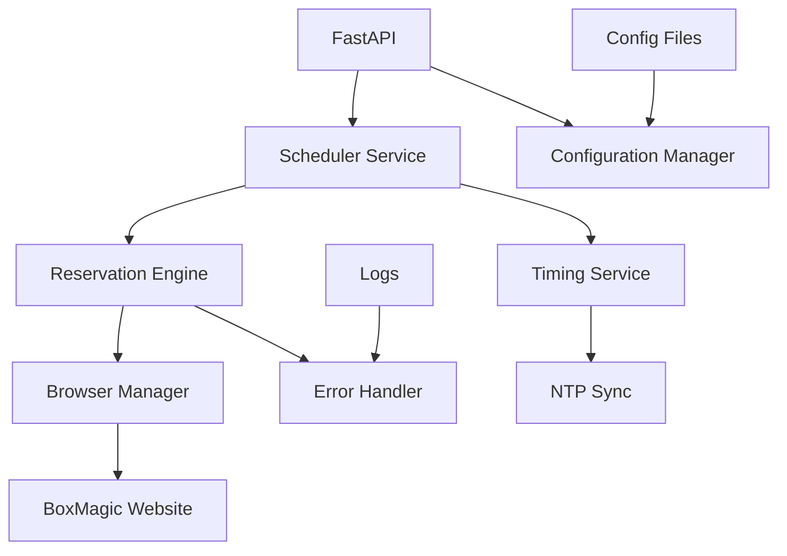
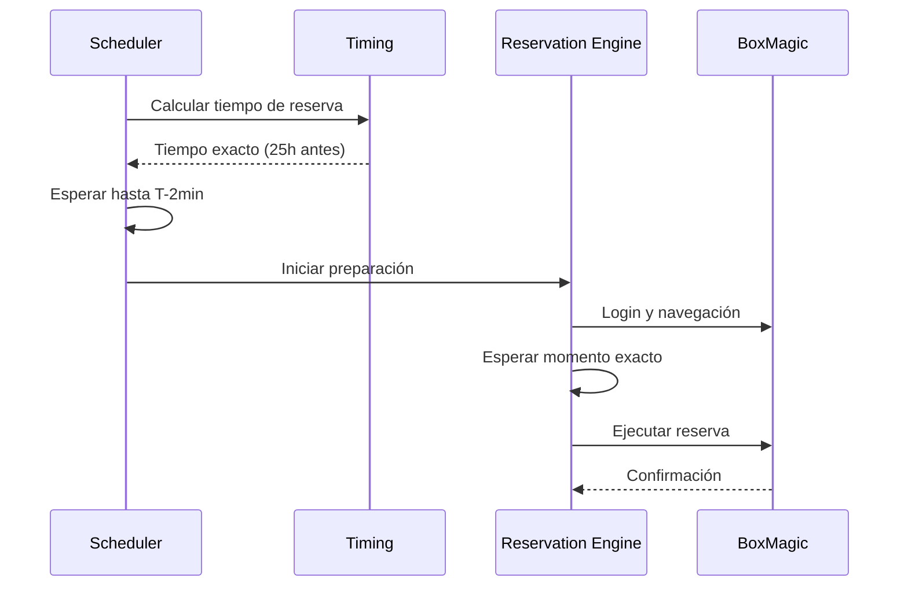

# Resumen Ejecutivo del Proyecto

## Información del Proyecto

| **Campo** | **Detalle** |
|-----------|-------------|
| **Nombre del Proyecto** | Sistema de Reserva Automática BoxMagic |
| **Tipo** | Aplicación Personal de Automatización Web |
| **Duración Estimada** | 3-4 semanas (MVP + Optimizaciones) |
| **Tecnología Principal** | Python + Playwright + FastAPI |
| **Plataforma Target** | fly.io (Cloud) |

## Problema y Solución

### Problema Central
Las clases de CrossFit en BoxMagic tienen **cupos limitados** que se agotan en **segundos**. Las reservas se abren exactamente **25 horas antes** del inicio de la clase, requiriendo precisión temporal imposible de lograr manualmente.

### Solución Propuesta
Sistema automatizado que:
- **Calcula automáticamente** cuándo hacer cada reserva
- **Navega automáticamente** por el sitio web BoxMagic
- **Ejecuta la reserva** en el segundo exacto de apertura
- **Opera 24/7** sin intervención manual

## Arquitectura del Sistema



### Componentes Principales

1. **Scheduler Service**: Orquesta el timing de las reservas
2. **Timing Service**: Mantiene precisión temporal con sincronización NTP
3. **Reservation Engine**: Ejecuta el proceso de reserva automática
4. **Browser Manager**: Gestiona la automatización web con Playwright
5. **Error Handler**: Maneja recuperación automática de fallas

## Flujo de Operación

### Flujo Normal


### Timing Crítico
- **T-25h**: Apertura de reservas
- **T-2min**: Inicio de preparación
- **T-90s**: Navegación y login
- **T-10s**: Espera precisa (monitoreo cada 100ms)
- **T-0s**: Ejecución exacta (monitoreo cada 10ms)

## Especificaciones Técnicas

### Stack Tecnológico
```yaml
Backend:
  - Python 3.11+
  - FastAPI (API REST)
  - APScheduler (Scheduling)
  - Playwright (Web Automation)
  - Pendulum (Time Handling)

Infrastructure:
  - Docker (Containerización)
  - fly.io (Cloud Deployment)
  - GitHub Actions (CI/CD)

Monitoring:
  - Loguru (Structured Logging)
  - Health Checks
  - Performance Metrics
```

### Configuración de Ejemplo
```json
{
  "clases": {
    "lunes": {
      "clase": "CrossFit",
      "horario": "08:00-09:00",
      "habilitado": true
    },
    "miercoles": {
      "clase": "Competitor", 
      "horario": "19:00-20:00",
      "habilitado": true
    }
  },
  "timing": {
    "offset_horas": 25,
    "preparacion_minutos": 2,
    "precision_ms": 100
  }
}
```

## Casos de Uso Principales

### CU-01: Reserva Automática Exitosa
- **Precondición**: Clase configurada, sistema operativo
- **Flujo**: Scheduler → Navegación → Timing Exacto → Reserva
- **Resultado**: Clase reservada exitosamente

### CU-02: Recuperación de Errores
- **Escenario**: Falla de navegación o elementos web
- **Respuesta**: Detección automática → Reintentos → Recuperación
- **Fallback**: Logging detallado para troubleshooting

### CU-03: Gestión de Configuración
- **Funcionalidad**: Actualizar clases, horarios, habilitar/deshabilitar días
- **Interface**: API REST + archivos de configuración
- **Validación**: Automática con feedback inmediato

## Criterios de Éxito

### Métricas Primarias
| **Métrica** | **Objetivo** | **Crítico** |
|-------------|--------------|-------------|
| **Timing Accuracy** | ±500ms | ±2s |
| **Success Rate** | >95% | >80% |
| **Navigation Time** | <80s | <120s |
| **System Uptime** | >99% | >95% |

### Métricas Secundarias
- **Recovery Time**: <30s para errores menores
- **Error Detection**: <3s para fallas críticas
- **Memory Usage**: Estable durante operación 24/7
- **Response Time**: API <200ms para endpoints básicos

## Gestión de Riesgos

### Riesgos Técnicos
| **Riesgo** | **Probabilidad** | **Impacto** | **Mitigación** |
|------------|------------------|-------------|----------------|
| Cambios UI BoxMagic | Media | Alto | Selectores múltiples + monitoreo |
| Latencia de Red | Alta | Medio | Compensación automática + múltiples servidores |
| Fallas de Browser | Baja | Alto | Recuperación automática + restart |
| Drift Temporal | Media | Crítico | Sincronización NTP continua |

### Riesgos de Negocio
- **Detección de Bot**: Configuración human-like del browser
- **Cambios de Horarios**: Sistema de configuración flexible
- **Sobrecarga del Sitio**: Rate limiting y timing distribuido

## Plan de Implementación

### Fase 1: MVP (Semana 1)
- ✅ **Días 1-2**: Setup y configuración base
- ✅ **Días 3-4**: Sistema de timing crítico
- ✅ **Días 5-6**: Automatización web básica
- ✅ **Días 7**: API y testing inicial

### Fase 2: Robustez (Semana 2)
- ✅ **Días 8-9**: Manejo avanzado de errores
- ✅ **Días 10-11**: Logging y observabilidad
- ✅ **Días 12-14**: Testing exhaustivo

### Fase 3: Deployment (Semana 3)
- ✅ **Días 15-16**: Containerización y CI/CD
- ✅ **Días 17-18**: Deploy cloud y monitoreo
- ✅ **Días 19-21**: Optimización y documentación

## Recursos Necesarios

### Técnicos
- **Desarrollo**: 1 desarrollador full-time
- **Infraestructura**: fly.io (~$5-10/mes)
- **Herramientas**: GitHub, Docker, VS Code

### Externos
- **BoxMagic Website**: Disponibilidad y estabilidad
- **Conectividad**: Internet estable para timing crítico
- **NTP Servers**: Para sincronización temporal

## ROI y Beneficios

### Beneficios Tangibles
- **100% Automation**: Elimina necesidad de reserva manual
- **Perfect Timing**: Reservas en el segundo exacto
- **24/7 Operation**: Funciona sin supervisión
- **High Success Rate**: >95% de reservas exitosas

### Beneficios Intangibles
- **Tranquilidad**: No preocuparse por perder clases
- **Consistencia**: Rutina de ejercicio garantizada
- **Aprendizaje**: Experiencia en automatización web crítica

## Conclusión

El sistema de reserva automática BoxMagic es una solución técnicamente viable y necesaria para resolver un problema real de timing crítico. La arquitectura propuesta es robusta pero simple, adecuada para una aplicación personal que requiere alta confiabilidad.

### Factores Clave de Éxito
1. **Timing Precision**: Implementación cuidadosa del sistema temporal
2. **Error Resilience**: Recuperación automática robusta
3. **Monitoring**: Observabilidad completa para troubleshooting
4. **Simplicity**: Mantener simplicidad sin comprometer funcionalidad

### Siguiente Pasos
1. **Aprobación del diseño** y plan de implementación
2. **Setup del entorno de desarrollo**
3. **Inicio de Fase 1**: MVP en 1 semana
4. **Iteración continua** basada en resultados reales

Este proyecto representa una solución elegante a un problema específico, con potencial de extensión a otros sistemas similares de reserva con timing crítico.
