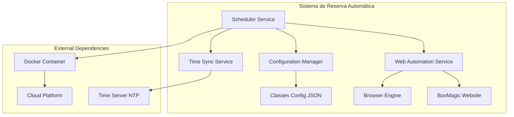
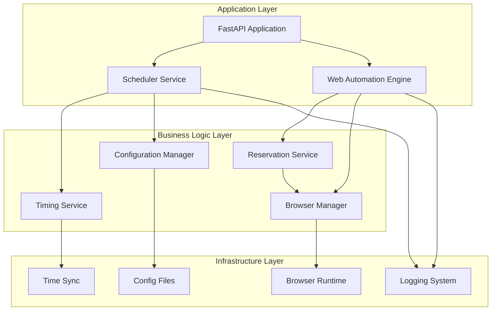
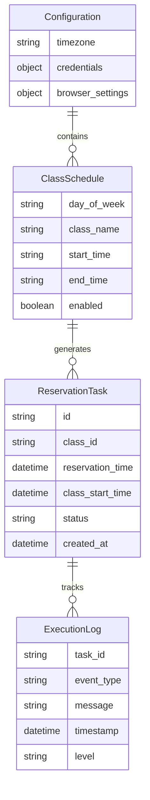
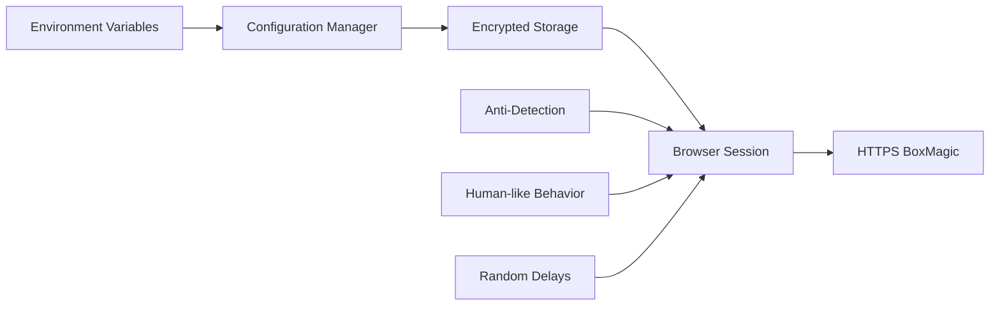
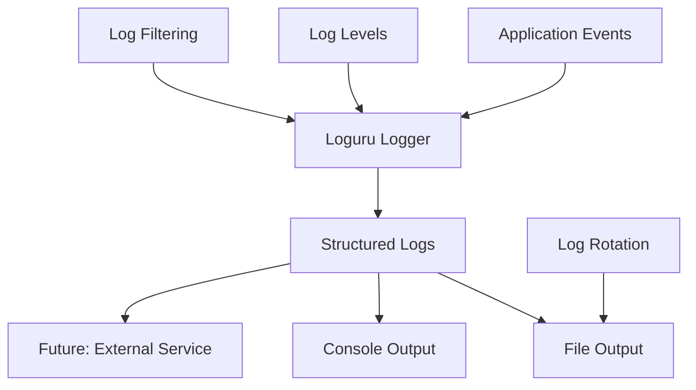
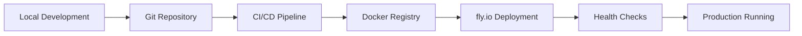

# Arquitectura y Tecnologías del Sistema

## 1. Arquitectura General

### Visión de Alto Nivel



### Principios Arquitectónicos

1. **Separación de Responsabilidades**: Cada componente tiene una función específica
2. **Timing Crítico**: Diseño optimizado para precisión temporal
3. **Resilencia**: Manejo robusto de errores sin comprometer la funcionalidad crítica
4. **Simplicidad**: Arquitectura simple pero efectiva para una aplicación personal

## 2. Stack Tecnológico

### Tecnologías Core

| Componente | Tecnología | Versión | Justificación |
|------------|------------|---------|---------------|
| **Runtime** | Python | 3.11+ | Ecosistema robusto, librerías de automatización |
| **Web Automation** | Playwright | ^1.40 | Mejor rendimiento y estabilidad que Selenium |
| **Web Framework** | FastAPI | ^0.104 | Async/await nativo, performance, documentación automática |
| **Scheduling** | APScheduler | ^3.10 | Scheduling robusto con precisión de segundos |
| **HTTP Client** | httpx | ^0.25 | Cliente HTTP async compatible con FastAPI |
| **Configuration** | Pydantic | ^2.4 | Validación de datos y settings management |
| **Logging** | Loguru | ^0.7 | Logging simple y potente |
| **Time Handling** | pendulum | ^2.1 | Manejo avanzado de zonas horarias |

### Infraestructura

| Componente | Tecnología | Justificación |
|------------|------------|---------------|
| **Containerización** | Docker | Portabilidad y deployment consistente |
| **Orquestación** | Docker Compose | Simplicidad para aplicación monolítica |
| **Cloud Platform** | fly.io | Deployment simple, buena performance en Latam |
| **Browser** | Chromium | Incluido con Playwright, optimizado para automatización |

## 3. Arquitectura de Componentes

### Diagrama de Componentes



### Descripción de Componentes

#### Scheduler Service
**Responsabilidad**: Gestión temporal y orquestación de reservas
- Calcula timing de reservas (25 horas antes)
- Ejecuta procesos en momento exacto
- Gestiona cola de reservas pendientes
- Monitorea estado del sistema

#### Web Automation Engine  
**Responsabilidad**: Automatización del navegador web
- Gestión de sesiones de browser
- Navegación automatizada en BoxMagic
- Ejecución de acciones de reserva
- Manejo de errores de UI

#### Configuration Manager
**Responsabilidad**: Gestión de configuración
- Carga configuración de clases
- Validación de parámetros
- Gestión de credenciales
- Configuración de horarios

#### Timing Service
**Responsabilidad**: Precisión temporal crítica
- Sincronización con servidores NTP
- Cálculo de delays y compensaciones
- Conversión de zonas horarias
- Validación de timing exacto

#### Reservation Service
**Responsabilidad**: Lógica de negocio de reservas
- Algoritmo de reserva paso a paso
- Validación de elementos web
- Gestión de estados de reserva
- Logging de procesos de reserva

#### Browser Manager
**Responsabilidad**: Gestión del navegador Chromium
- Inicialización y configuración de browser
- Gestión de contextos y páginas
- Optimización de performance
- Gestión de recursos y cleanup

## 4. Patrones de Diseño Aplicados

### Singleton Pattern
- **Browser Manager**: Una sola instancia del navegador
- **Configuration Manager**: Una sola instancia de configuración

### Factory Pattern
- **Browser Factory**: Creación de instancias de browser optimizadas
- **Service Factory**: Creación de servicios con configuración específica

### Observer Pattern
- **Event System**: Notificación de eventos de reserva y errores
- **Status Monitoring**: Seguimiento de estado del sistema

### Strategy Pattern
- **Timing Strategies**: Diferentes estrategias de timing según contexto
- **Error Handling**: Diferentes estrategias de recuperación de errores

## 5. Arquitectura de Datos

### Modelo de Configuración



### Estructura de Archivos de Configuración

```json
{
  "app_config": {
    "timezone": "America/Santiago",
    "browser": {
      "headless": true,
      "timeout": 30000,
      "viewport": {"width": 1280, "height": 720}
    },
    "timing": {
      "reservation_offset_hours": 25,
      "preparation_minutes": 2,
      "navigation_buffer_seconds": 60
    }
  },
  "credentials": {
    "url": "https://go.boxmagic.app/bienvenida/entrada?modo=ingreso",
    "email": "gtcarvacho@gmail.com",
    "password": "Fitoko2024"
  },
  "class_schedule": {
    "monday": {
      "class_name": "CrossFit",
      "start_time": "08:00",
      "end_time": "09:00",
      "enabled": true
    }
  }
}
```

## 6. Arquitectura de Seguridad

### Consideraciones de Seguridad

1. **Credenciales**: Almacenamiento seguro usando variables de entorno
2. **Browser Fingerprinting**: Configuración para aparecer como usuario humano
3. **Rate Limiting**: Evitar patrones de automatización detectables
4. **SSL/TLS**: Todas las comunicaciones cifradas
5. **Logs**: No exposición de credenciales en logs

### Diagrama de Seguridad



## 7. Arquitectura de Monitoreo

### Sistema de Logging



### Métricas Clave
- **Timing Accuracy**: Precisión de ejecución de reservas
- **Success Rate**: Porcentaje de reservas exitosas
- **Error Rate**: Frecuencia y tipos de errores
- **Performance**: Tiempos de navegación y respuesta

## 8. Consideraciones de Performance

### Optimizaciones de Browser
- **Lightweight Profile**: Browser sin extensiones ni cache pesado
- **Resource Blocking**: Bloqueo de imágenes/videos innecesarios
- **Connection Pooling**: Reutilización de conexiones
- **Preload**: Pre-carga de elementos críticos

### Optimizaciones de Timing
- **NTP Sync**: Sincronización continua con servidor de tiempo
- **Compensation**: Compensación de latencias medidas
- **Predictive Loading**: Carga predictiva de elementos web
- **Connection Warmup**: Conexiones pre-establecidas

## 9. Arquitectura de Deployment

### Containerización

```dockerfile
# Estrategia de Dockerfile multicapa
FROM python:3.11-slim as base
# Instalación de dependencias del sistema
# Instalación de Playwright y browsers

FROM base as app
# Copia de código de aplicación
# Configuración de entrada y healthchecks
```

### Orquestación con Docker Compose

```yaml
services:
  reserva-app:
    build: .
    environment:
      - TZ=America/Santiago
    volumes:
      - ./config:/app/config
      - ./logs:/app/logs
    restart: unless-stopped
```

### Cloud Deployment Strategy



Esta arquitectura asegura un sistema robusto, mantenible y escalable para las necesidades específicas del proyecto de reserva automática.
