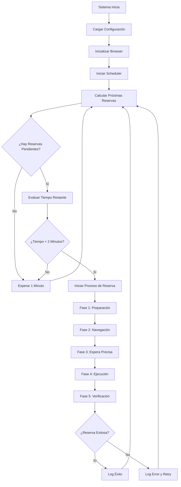
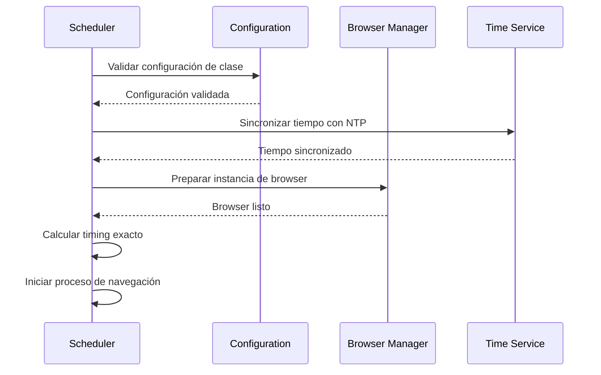
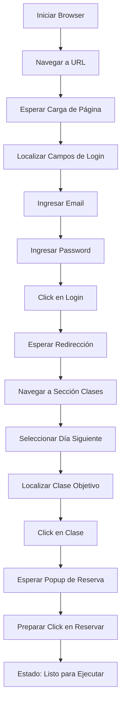
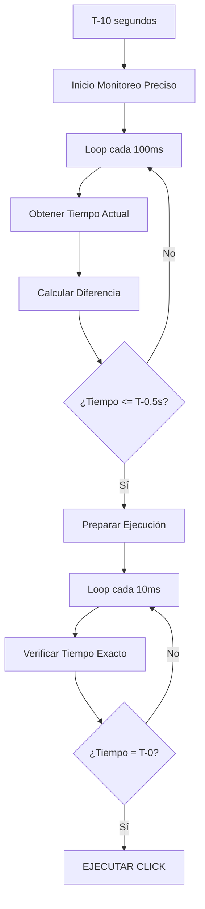
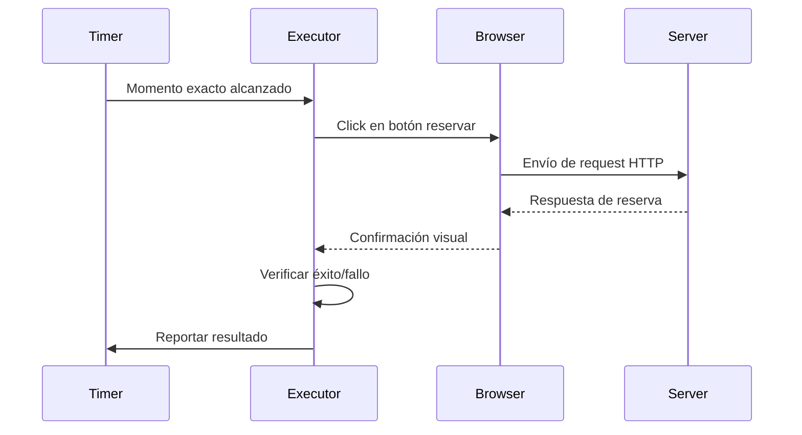
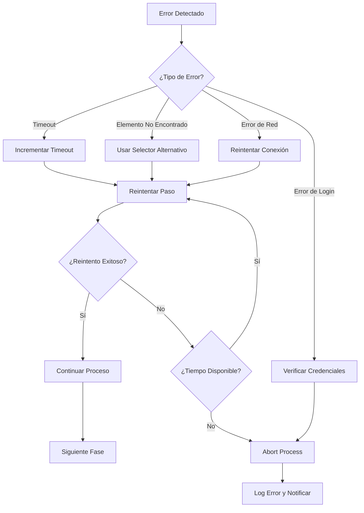
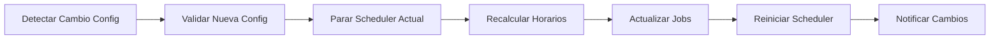

# Flujo Detallado de la Aplicación

## 1. Flujo General del Sistema

### Diagrama de Flujo Principal



## 2. Flujo Detallado de Reserva

### 2.1 Fase 1: Preparación del Sistema (T-120 segundos)

#### Actividades de Preparación



**Pseudocódigo de Preparación**:
```python
def prepare_reservation(class_config):
    # 1. Validar configuración
    validate_class_config(class_config)
    
    # 2. Sincronizar tiempo
    ntp_time = sync_with_ntp_server()
    local_drift = calculate_time_drift(ntp_time)
    
    # 3. Calcular timing exacto
    reservation_time = calculate_exact_reservation_time(
        class_config.start_time,
        offset_hours=25
    )
    
    # 4. Preparar browser
    browser_context = prepare_browser_context()
    
    # 5. Iniciar navegación
    navigation_task = start_navigation_process(
        browser_context, 
        target_time=reservation_time
    )
    
    return navigation_task
```

### 2.2 Fase 2: Navegación y Login (T-90 a T-10 segundos)

#### Flujo de Navegación



#### Implementación de Navegación

```python
async def navigation_phase(browser_context, class_config):
    page = await browser_context.new_page()
    
    try:
        # 1. Navegación inicial
        await page.goto(CROSSFIT_URL, wait_until='networkidle')
        await log_step("Página cargada", "success")
        
        # 2. Login
        await login_sequence(page)
        
        # 3. Navegación a clases
        await navigate_to_classes(page)
        
        # 4. Selección de día
        target_day = get_next_day()
        await select_day(page, target_day)
        
        # 5. Localización de clase
        class_element = await find_class_element(page, class_config)
        
        # 6. Click en clase y preparar popup
        await class_element.click()
        reserve_button = await wait_for_reserve_button(page)
        
        return page, reserve_button
        
    except Exception as e:
        await log_step(f"Error en navegación: {e}", "error")
        raise
```

#### Selectores Web Específicos

```python
SELECTORS = {
    "login": {
        "email_field": "input[type='email']",
        "password_field": "input[type='password']", 
        "login_button": "button[type='submit']"
    },
    "navigation": {
        "classes_menu": "div[data-v-32448cd4] .texto:has-text('Clases')",
        "classes_menu_path": "/html/body/div[1]/div/div/div/div[2]/div[3]/div[2]/a[3]/div[2]"
    },
    "day_selection": {
        "day_container": "span[data-v-4a63fb7f].diaNumero",
        "day_pattern": "span.diaSemana:has-text('{day}') + span:has-text('{date}')"
    },
    "class_selection": {
        "class_title": "p[data-v-64a261dd].text-lg.text-capitalize",
        "class_pattern": "p:has-text('{class_name} {time}')"
    },
    "reservation": {
        "reserve_button": "span[data-v-8ac6a486]:has-text('Reservar')"
    }
}
```

### 2.3 Fase 3: Espera Precisa (T-10 a T-0 segundos)

#### Sistema de Timing Preciso



#### Implementación de Timing Preciso

```python
async def precise_timing_wait(target_time, reserve_button):
    """
    Espera hasta el momento exacto para ejecutar la reserva
    """
    # Fase 1: Monitoreo grueso (cada 100ms)
    while True:
        current_time = get_precise_time()
        time_diff = (target_time - current_time).total_seconds()
        
        if time_diff <= 0.5:  # Cambiar a monitoreo fino
            break
            
        if time_diff > 10:
            await asyncio.sleep(1)  # Espera larga
        else:
            await asyncio.sleep(0.1)  # Espera corta
    
    # Fase 2: Monitoreo fino (cada 10ms)
    while True:
        current_time = get_precise_time()
        time_diff = (target_time - current_time).total_seconds()
        
        if time_diff <= 0:
            # MOMENTO EXACTO - EJECUTAR
            await execute_reservation_click(reserve_button)
            break
            
        await asyncio.sleep(0.01)  # 10ms precision
```

### 2.4 Fase 4: Ejecución de Reserva (T-0)

#### Secuencia de Ejecución



#### Implementación de Ejecución

```python
async def execute_reservation_click(reserve_button):
    """
    Ejecuta el click de reserva con máxima precisión
    """
    start_time = time.time()
    
    try:
        # Click con timeout mínimo
        await reserve_button.click(timeout=5000)
        
        # Verificación inmediata
        success = await verify_reservation_success()
        
        end_time = time.time()
        execution_duration = (end_time - start_time) * 1000  # ms
        
        await log_execution_result(success, execution_duration)
        
        return success
        
    except Exception as e:
        end_time = time.time()
        execution_duration = (end_time - start_time) * 1000
        
        await log_execution_error(e, execution_duration)
        return False
```

### 2.5 Fase 5: Verificación y Logging

#### Verificación de Éxito

```python
async def verify_reservation_success(page, timeout=5000):
    """
    Verifica que la reserva fue exitosa
    """
    try:
        # Buscar indicadores de éxito
        success_indicators = [
            "text=Reserva confirmada",
            "text=¡Reserva exitosa!",
            "[data-testid='success-message']",
            ".success-notification"
        ]
        
        for indicator in success_indicators:
            try:
                await page.wait_for_selector(indicator, timeout=timeout/len(success_indicators))
                return True
            except:
                continue
        
        # Verificar indicadores de error
        error_indicators = [
            "text=Sin cupos disponibles",
            "text=Error en la reserva",
            ".error-message"
        ]
        
        for indicator in error_indicators:
            try:
                await page.wait_for_selector(indicator, timeout=1000)
                return False
            except:
                continue
                
        # Si no hay indicadores claros, asumir éxito
        return True
        
    except Exception:
        return False
```

## 3. Flujos de Casos Especiales

### 3.1 Manejo de Errores Durante Navegación



### 3.2 Recuperación de Fallas de Browser

```python
async def handle_browser_failure():
    """
    Maneja fallas críticas del browser
    """
    try:
        # 1. Cerrar instancia actual
        await browser.close()
        
        # 2. Crear nueva instancia
        browser = await create_new_browser_instance()
        
        # 3. Verificar tiempo disponible
        time_remaining = calculate_time_until_reservation()
        
        if time_remaining > 30:  # 30 segundos mínimos
            # Reiniciar desde navegación
            return await restart_navigation_process(browser)
        else:
            # Tiempo insuficiente
            raise Exception("Tiempo insuficiente para recuperación")
            
    except Exception as e:
        await log_critical_error(f"Recuperación fallida: {e}")
        raise
```

### 3.3 Flujo de Configuración Dinámica



## 4. Monitoreo y Observabilidad

### 4.1 Métricas Clave por Fase

| Fase | Métrica | Objetivo | Alerta |
|------|---------|----------|--------|
| Preparación | Tiempo de setup | < 10s | > 15s |
| Navegación | Tiempo total | < 80s | > 90s |
| Espera Precisa | Drift timing | < 100ms | > 500ms |
| Ejecución | Tiempo de click | < 200ms | > 1s |
| Verificación | Tiempo detección | < 5s | > 10s |

### 4.2 Logging Estructurado

```python
log_structure = {
    "timestamp": "2025-01-16T17:58:45.123-03:00",
    "level": "INFO",
    "component": "navigation",
    "phase": "login",
    "step": "enter_credentials",
    "status": "success",
    "duration_ms": 1234,
    "details": {
        "url": "https://go.boxmagic.app/...",
        "selector": "input[type='email']",
        "retry_count": 0
    },
    "context": {
        "reservation_id": "res_001",
        "class_name": "Competitor 19:00-20:00",
        "target_time": "2025-01-16T18:00:00-03:00"
    }
}
```

Este flujo detallado asegura que cada paso del proceso de reserva esté claramente definido, monitoreado y sea recuperable en caso de errores, manteniendo la precisión temporal crítica requerida para el éxito del sistema.
