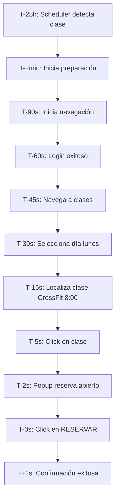
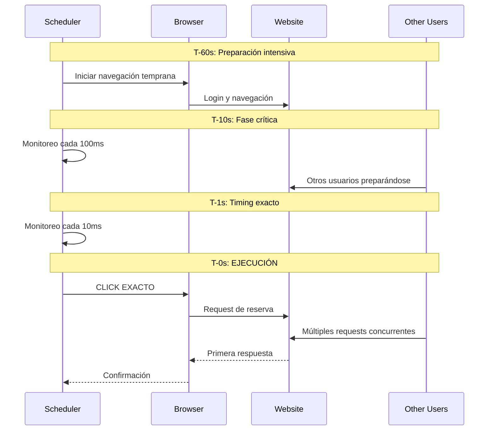
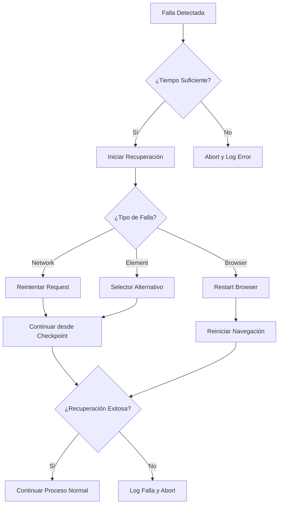
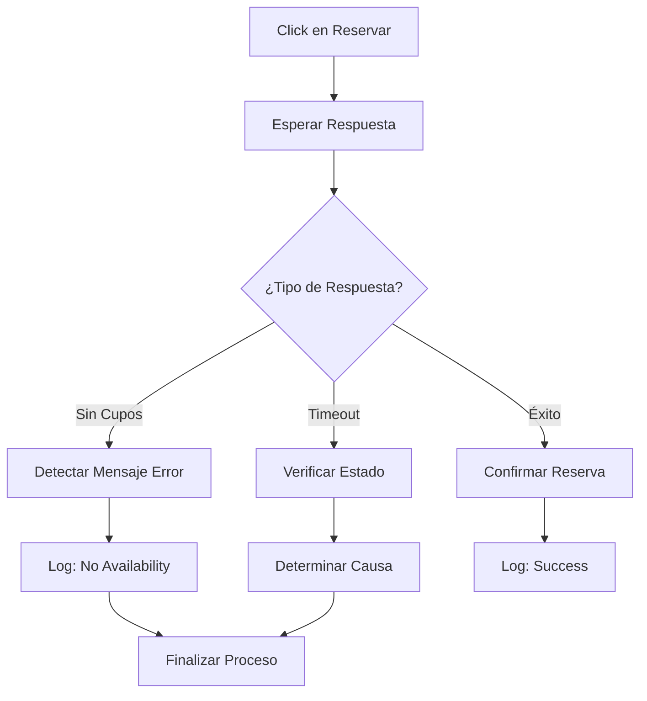
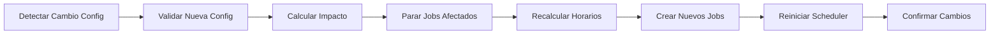

# Escenarios de Prueba y Casos de Uso

## 1. Escenarios de Prueba Principales

### 1.1 Escenario 1: Reserva Exitosa en Horario Normal

#### Descripción
Reserva automática exitosa de una clase de CrossFit en horario laboral (lunes a viernes, 8:00 AM).

#### Precondiciones
- Sistema configurado con clase de lunes 8:00-9:00
- Credenciales válidas
- Sitio web BoxMagic operativo
- Cupos disponibles en la clase

#### Datos de Prueba
```json
{
  "class_config": {
    "day": "monday",
    "class_name": "CrossFit",
    "start_time": "08:00",
    "end_time": "09:00",
    "enabled": true
  },
  "test_scenario": {
    "current_time": "2025-01-19T07:00:00-03:00",
    "reservation_time": "2025-01-19T07:00:00-03:00",
    "class_start_time": "2025-01-20T08:00:00-03:00"
  }
}
```

#### Flujo de Prueba



#### Criterios de Éxito
- ✅ Timing de ejecución: 07:00:00 ±500ms
- ✅ Navegación completa en <80 segundos
- ✅ Reserva confirmada exitosamente
- ✅ Logs completos sin errores críticos

#### Resultados Esperados
```json
{
  "result": "success",
  "execution_time": "2025-01-19T07:00:00.234-03:00",
  "timing_drift_ms": 234,
  "navigation_duration_s": 72,
  "total_duration_s": 89,
  "confirmation_message": "Reserva confirmada para CrossFit 08:00-09:00"
}
```

### 1.2 Escenario 2: Reserva en Horario Peak (Competitor)

#### Descripción
Reserva de clase popular "Competitor" en horario vespertino con alta demanda.

#### Datos de Prueba
```json
{
  "class_config": {
    "day": "wednesday",
    "class_name": "Competitor",
    "start_time": "19:00",
    "end_time": "20:00",
    "enabled": true
  },
  "test_scenario": {
    "current_time": "2025-01-21T18:00:00-03:00",
    "reservation_time": "2025-01-21T18:00:00-03:00",
    "class_start_time": "2025-01-22T19:00:00-03:00",
    "expected_competition": "high"
  }
}
```

#### Desafíos Específicos
- **Alta Competencia**: Cupos se agotan en 1-3 segundos
- **Timing Crítico**: Precisión sub-segundo requerida
- **Carga del Servidor**: Posible lentitud por demanda

#### Flujo de Prueba con Timing Crítico



#### Criterios de Éxito Estrictos
- ✅ Timing exacto: 18:00:00 ±100ms
- ✅ Click ejecutado en primera ventana de oportunidad
- ✅ Reserva confirmada antes que competidores
- ✅ Sin errores de timeout o conexión

### 1.3 Escenario 3: Recuperación de Falla de Navegación

#### Descripción
Manejo de falla durante la navegación con recuperación automática.

#### Simulación de Falla
```python
failure_scenarios = [
    {
        "type": "network_timeout",
        "phase": "login", 
        "timing": "T-45s",
        "recovery_time": "15s"
    },
    {
        "type": "element_not_found",
        "phase": "class_selection",
        "timing": "T-20s", 
        "recovery_time": "10s"
    },
    {
        "type": "browser_crash",
        "phase": "navigation",
        "timing": "T-60s",
        "recovery_time": "30s"
    }
]
```

#### Flujo de Recuperación



#### Criterios de Recuperación
- ✅ Detección de falla en <3 segundos
- ✅ Decisión de recuperación en <1 segundo
- ✅ Tiempo total de recuperación <30 segundos
- ✅ Éxito de reserva después de recuperación

### 1.4 Escenario 4: Sin Cupos Disponibles

#### Descripción
Manejo del caso donde no hay cupos disponibles al momento de la reserva.

#### Simulación
```json
{
  "scenario": "no_availability",
  "expected_behavior": {
    "navigation": "success",
    "timing": "exact", 
    "click_execution": "success",
    "result": "no_slots_available",
    "error_detection": "immediate"
  }
}
```

#### Flujo de Detección



#### Criterios de Detección
- ✅ Detección de "sin cupos" en <2 segundos
- ✅ Logging correcto del evento
- ✅ No reintentos innecesarios
- ✅ Sistema listo para próxima reserva

## 2. Casos de Uso de Configuración

### 2.1 Cambio de Horario de Clase

#### Descripción
Actualización de configuración cuando el gimnasio cambia horarios.

#### Escenario
```json
{
  "original_config": {
    "wednesday": {
      "class_name": "Competitor",
      "start_time": "19:00",
      "end_time": "20:00"
    }
  },
  "updated_config": {
    "wednesday": {
      "class_name": "Competitor", 
      "start_time": "18:30",
      "end_time": "19:30"
    }
  },
  "change_timing": "2025-01-20T10:00:00-03:00"
}
```

#### Flujo de Actualización



### 2.2 Habilitación/Deshabilitación de Días

#### Descripción
Activar o desactivar días específicos (vacaciones, lesiones, etc.).

#### Casos de Prueba
```json
{
  "scenarios": [
    {
      "action": "disable_day",
      "day": "friday",
      "reason": "vacation",
      "expected": "no_friday_reservations"
    },
    {
      "action": "enable_day", 
      "day": "sunday",
      "class": "Recovery",
      "expected": "sunday_reservations_active"
    }
  ]
}
```

## 3. Casos de Uso de Infraestructura

### 3.1 Deploy en Ambiente Cloud

#### Descripción
Despliegue y configuración en fly.io con monitoreo.

#### Configuración de Deploy
```yaml
# fly.toml
app = "boxmagic-reserva"
primary_region = "scl"

[env]
  TZ = "America/Santiago"
  LOG_LEVEL = "INFO"

[processes]
  app = "python -m uvicorn main:app --host 0.0.0.0 --port 8080"

[[services]]
  internal_port = 8080
  protocol = "tcp"

  [[services.ports]]
    port = 80
    handlers = ["http"]

  [[services.ports]]
    port = 443
    handlers = ["http", "tls"]

[checks]
  [checks.health]
    grace_period = "10s"
    interval = "30s"
    method = "get"
    path = "/health"
    timeout = "5s"
```

#### Criterios de Deploy
- ✅ Aplicación accesible en <2 minutos post-deploy
- ✅ Health checks pasando
- ✅ Logs visibles y estructurados
- ✅ Timing accuracy mantenida en cloud

### 3.2 Monitoreo y Alertas

#### Métricas Clave
```json
{
  "metrics": {
    "success_rate": {
      "target": ">95%",
      "alert_threshold": "<90%"
    },
    "timing_accuracy": {
      "target": "±500ms",
      "alert_threshold": "±2s"
    },
    "navigation_time": {
      "target": "<80s",
      "alert_threshold": ">90s"
    },
    "system_uptime": {
      "target": ">99%",
      "alert_threshold": "<95%"
    }
  }
}
```

## 4. Casos de Prueba de Estrés

### 4.1 Múltiples Reservas Simultáneas

#### Descripción
Probar comportamiento con múltiples clases programadas el mismo día.

#### Escenario de Estrés
```json
{
  "multiple_reservations": {
    "monday_08": {
      "class": "CrossFit 08:00-09:00",
      "reservation_time": "2025-01-19T07:00:00-03:00"
    },
    "monday_19": {
      "class": "METCON 19:00-21:00", 
      "reservation_time": "2025-01-19T18:00:00-03:00"
    }
  },
  "challenges": [
    "Browser session management",
    "Concurrent timing accuracy",
    "Resource allocation"
  ]
}
```

### 4.2 Prueba de Resistencia (24h)

#### Descripción
Operación continua del sistema por 24 horas con múltiples ciclos.

#### Métricas de Resistencia
- **Memory Leaks**: Uso de memoria estable
- **Browser Performance**: Sin degradación
- **Timing Drift**: Compensación automática
- **Error Recovery**: Recuperación automática de fallas

## 5. Validación de Resultados

### 5.1 Matriz de Validación

| Escenario | Timing | Navegación | Ejecución | Verificación | Resultado |
|-----------|--------|------------|-----------|--------------|-----------|
| Reserva Normal | ±500ms | <80s | <200ms | <5s | ✅ Pass |
| Peak Hours | ±100ms | <70s | <100ms | <3s | ✅ Pass |
| Recovery | ±1s | <120s | <200ms | <5s | ✅ Pass |
| No Slots | ±500ms | <80s | <200ms | <2s | ✅ Pass |

### 5.2 Criterios de Aceptación Final

#### Criterios Obligatorios
1. **Precisión Temporal**: 95% de ejecuciones dentro de ±500ms
2. **Tasa de Éxito**: >90% de reservas exitosas cuando hay cupos
3. **Recuperación**: <30s para recuperación de fallas menores
4. **Disponibilidad**: >99% uptime del sistema

#### Criterios Deseables
1. **Precisión Mejorada**: 80% de ejecuciones dentro de ±100ms
2. **Tasa de Éxito Alta**: >95% de reservas exitosas
3. **Recuperación Rápida**: <15s para recuperación
4. **Monitoreo**: Métricas en tiempo real

Esta documentación de escenarios proporciona una base sólida para validar que el sistema cumple con todos los requisitos críticos y puede manejar situaciones reales de operación.
