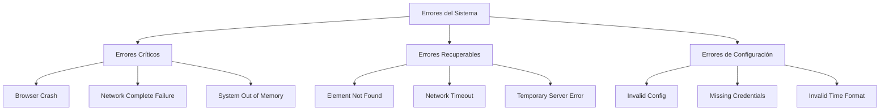

# Gestión de Errores y Manejo de Excepciones

## 1. Estrategia General de Manejo de Errores

### 1.1 Filosofía de Manejo de Errores

El sistema de reservas automáticas debe ser **resiliente por diseño**, priorizando la continuidad del servicio sobre la perfección. Dado que se trata de una aplicación personal, el enfoque está en:

1. **Recuperación Automática**: Intentar resolver errores sin intervención manual
2. **Graceful Degradation**: Fallar de manera controlada cuando no es posible recuperarse
3. **Logging Detallado**: Registrar información suficiente para troubleshooting posterior
4. **Timing Preservation**: Nunca comprometer la precisión temporal por manejo de errores

### 1.2 Taxonomía de Errores



## 2. Errores Críticos (No Recuperables)

### 2.1 Falla Completa del Browser

#### Descripción
El proceso de Chromium se termina inesperadamente o no puede iniciarse.

#### Detección
```python
class BrowserFailureError(Exception):
    """Browser process terminated or failed to start"""
    pass

async def detect_browser_failure(browser):
    try:
        # Verificar que el browser esté vivo
        contexts = browser.contexts
        if not contexts:
            raise BrowserFailureError("No browser contexts available")
            
        # Test básico de conectividad
        page = await contexts[0].new_page()
        await page.goto("about:blank", timeout=5000)
        await page.close()
        
    except Exception as e:
        raise BrowserFailureError(f"Browser health check failed: {e}")
```

#### Estrategia de Respuesta
```python
async def handle_browser_failure(reservation_context):
    """
    Manejo de falla crítica del browser
    """
    start_time = time.time()
    time_until_reservation = calculate_time_remaining(reservation_context.target_time)
    
    try:
        # 1. Log crítico
        logger.critical(
            "Browser failure detected",
            extra={
                "reservation_id": reservation_context.id,
                "time_remaining": time_until_reservation,
                "failure_type": "browser_crash"
            }
        )
        
        # 2. Evaluar viabilidad de recuperación
        if time_until_reservation < 30:  # 30 segundos mínimos
            await abort_reservation(
                reservation_context,
                reason="Insufficient time for browser recovery"
            )
            return False
        
        # 3. Intentar recuperación
        new_browser = await create_emergency_browser()
        await restart_navigation_from_scratch(new_browser, reservation_context)
        
        recovery_time = time.time() - start_time
        logger.info(f"Browser recovery successful in {recovery_time:.2f}s")
        return True
        
    except Exception as recovery_error:
        await abort_reservation(
            reservation_context,
            reason=f"Browser recovery failed: {recovery_error}"
        )
        return False
```

### 2.2 Falla de Red Completa

#### Detección y Manejo
```python
class NetworkFailureError(Exception):
    """Complete network connectivity loss"""
    pass

async def detect_network_failure():
    """
    Detectar falla completa de conectividad
    """
    test_urls = [
        "https://google.com",
        "https://go.boxmagic.app",
        "https://1.1.1.1"  # Cloudflare DNS
    ]
    
    failed_connections = 0
    
    for url in test_urls:
        try:
            async with httpx.AsyncClient(timeout=5.0) as client:
                response = await client.get(url)
                if response.status_code < 500:
                    return False  # Al menos una conexión exitosa
        except:
            failed_connections += 1
    
    if failed_connections == len(test_urls):
        raise NetworkFailureError("Complete network connectivity loss")
    
    return False

async def handle_network_failure(reservation_context):
    """
    Manejo de falla de red completa
    """
    logger.critical(
        "Complete network failure detected",
        extra={"reservation_id": reservation_context.id}
    )
    
    # No hay recuperación posible para falla de red completa
    await abort_reservation(
        reservation_context,
        reason="Complete network connectivity loss"
    )
    
    # Programar reintento para próxima clase
    await schedule_next_attempt(reservation_context.class_config)
```

## 3. Errores Recuperables

### 3.1 Elementos Web No Encontrados

#### Estrategia de Recuperación por Capas

```python
class ElementNotFoundError(Exception):
    """Web element could not be located"""
    pass

class ElementLocator:
    """
    Sistema de localización de elementos con múltiples estrategias
    """
    
    def __init__(self):
        self.strategies = [
            self._locate_by_primary_selector,
            self._locate_by_alternative_selector,
            self._locate_by_text_content,
            self._locate_by_xpath_fallback
        ]
    
    async def find_element_with_retry(self, page, element_config, max_retries=3):
        """
        Localizar elemento con múltiples estrategias de fallback
        """
        last_error = None
        
        for attempt in range(max_retries):
            for strategy_index, strategy in enumerate(self.strategies):
                try:
                    element = await strategy(page, element_config)
                    if element:
                        logger.debug(
                            f"Element found using strategy {strategy_index}",
                            extra={
                                "element": element_config.name,
                                "strategy": strategy.__name__,
                                "attempt": attempt + 1
                            }
                        )
                        return element
                        
                except Exception as e:
                    last_error = e
                    logger.debug(
                        f"Strategy {strategy_index} failed: {e}",
                        extra={"element": element_config.name}
                    )
                    continue
            
            # Esperar antes del siguiente intento
            if attempt < max_retries - 1:
                await asyncio.sleep(2 ** attempt)  # Backoff exponencial
        
        # Todas las estrategias fallaron
        raise ElementNotFoundError(
            f"Could not locate element {element_config.name} "
            f"after {max_retries} attempts. Last error: {last_error}"
        )
    
    async def _locate_by_primary_selector(self, page, config):
        """Estrategia primaria usando selector CSS/XPath"""
        return await page.wait_for_selector(config.primary_selector, timeout=5000)
    
    async def _locate_by_alternative_selector(self, page, config):
        """Estrategia alternativa con selector de backup"""
        if hasattr(config, 'alternative_selector'):
            return await page.wait_for_selector(config.alternative_selector, timeout=5000)
        return None
    
    async def _locate_by_text_content(self, page, config):
        """Estrategia basada en contenido de texto"""
        if hasattr(config, 'text_content'):
            return await page.wait_for_selector(
                f"text={config.text_content}", 
                timeout=5000
            )
        return None
    
    async def _locate_by_xpath_fallback(self, page, config):
        """Estrategia de último recurso con XPath robusto"""
        if hasattr(config, 'xpath_fallback'):
            return await page.wait_for_selector(
                f"xpath={config.xpath_fallback}", 
                timeout=5000
            )
        return None
```

#### Configuración de Elementos con Fallbacks

```python
ELEMENT_CONFIGS = {
    "login_email": {
        "name": "email_field",
        "primary_selector": "input[type='email']",
        "alternative_selector": "input[name='email']",
        "xpath_fallback": "//input[contains(@placeholder, 'email') or contains(@name, 'email')]"
    },
    "classes_menu": {
        "name": "classes_navigation",
        "primary_selector": "div[data-v-32448cd4] .texto:has-text('Clases')",
        "alternative_selector": ".navigation-menu .clases",
        "text_content": "Clases",
        "xpath_fallback": "/html/body/div[1]/div/div/div/div[2]/div[3]/div[2]/a[3]/div[2]"
    },
    "reserve_button": {
        "name": "reserve_button",
        "primary_selector": "span[data-v-8ac6a486]:has-text('Reservar')",
        "alternative_selector": "button:has-text('Reservar')",
        "text_content": "Reservar",
        "xpath_fallback": "//span[contains(text(), 'Reservar')] | //button[contains(text(), 'Reservar')]"
    }
}
```

### 3.2 Timeouts de Red

#### Sistema de Reintentos Inteligente

```python
class NetworkTimeoutHandler:
    """
    Manejo inteligente de timeouts de red
    """
    
    def __init__(self):
        self.base_timeout = 10.0
        self.max_retries = 3
        self.backoff_multiplier = 1.5
    
    async def execute_with_retry(self, operation, context):
        """
        Ejecutar operación con reintentos inteligentes
        """
        last_error = None
        
        for attempt in range(self.max_retries):
            timeout = self.base_timeout * (self.backoff_multiplier ** attempt)
            
            try:
                return await asyncio.wait_for(operation(), timeout=timeout)
                
            except asyncio.TimeoutError as e:
                last_error = e
                remaining_time = calculate_time_remaining(context.target_time)
                
                logger.warning(
                    f"Network timeout on attempt {attempt + 1}",
                    extra={
                        "operation": operation.__name__,
                        "timeout": timeout,
                        "remaining_time": remaining_time,
                        "attempt": attempt + 1
                    }
                )
                
                # Evaluar si vale la pena reintentar
                if remaining_time < 30:  # Menos de 30 segundos
                    logger.error("Insufficient time for retry")
                    break
                
                if attempt < self.max_retries - 1:
                    wait_time = min(2 ** attempt, 5)  # Max 5 segundos
                    await asyncio.sleep(wait_time)
        
        raise NetworkTimeoutError(f"Operation failed after {self.max_retries} attempts: {last_error}")
```

### 3.3 Errores de Servidor (5xx)

#### Manejo de Errores del Servidor BoxMagic

```python
class ServerErrorHandler:
    """
    Manejo de errores del servidor BoxMagic
    """
    
    async def handle_server_error(self, error_code, response_text, context):
        """
        Manejar errores específicos del servidor
        """
        error_handlers = {
            500: self._handle_internal_server_error,
            502: self._handle_bad_gateway,
            503: self._handle_service_unavailable,
            504: self._handle_gateway_timeout
        }
        
        handler = error_handlers.get(error_code, self._handle_generic_server_error)
        return await handler(response_text, context)
    
    async def _handle_internal_server_error(self, response_text, context):
        """Manejo de error 500"""
        logger.warning("Server internal error detected, waiting before retry")
        
        # Esperar un poco y reintentar
        await asyncio.sleep(2)
        return "retry"
    
    async def _handle_service_unavailable(self, response_text, context):
        """Manejo de error 503"""
        remaining_time = calculate_time_remaining(context.target_time)
        
        if remaining_time > 60:
            logger.warning("Service unavailable, waiting for recovery")
            await asyncio.sleep(10)
            return "retry"
        else:
            logger.error("Service unavailable with insufficient recovery time")
            return "abort"
    
    async def _handle_generic_server_error(self, response_text, context):
        """Manejo genérico de errores de servidor"""
        logger.error(f"Unhandled server error: {response_text}")
        return "abort"
```

## 4. Sistema de Circuit Breaker

### 4.1 Implementación de Circuit Breaker

```python
class CircuitBreaker:
    """
    Circuit breaker para prevenir cascada de errores
    """
    
    def __init__(self, failure_threshold=3, timeout=60):
        self.failure_threshold = failure_threshold
        self.timeout = timeout
        self.failure_count = 0
        self.last_failure_time = None
        self.state = "closed"  # closed, open, half-open
    
    async def call(self, operation):
        """
        Ejecutar operación a través del circuit breaker
        """
        if self.state == "open":
            if self._should_attempt_reset():
                self.state = "half-open"
                logger.info("Circuit breaker entering half-open state")
            else:
                raise CircuitBreakerOpenError("Circuit breaker is open")
        
        try:
            result = await operation()
            await self._on_success()
            return result
            
        except Exception as e:
            await self._on_failure()
            raise
    
    def _should_attempt_reset(self):
        """Determinar si intentar reset del circuit breaker"""
        return (
            self.last_failure_time and
            time.time() - self.last_failure_time > self.timeout
        )
    
    async def _on_success(self):
        """Manejar éxito de operación"""
        self.failure_count = 0
        if self.state == "half-open":
            self.state = "closed"
            logger.info("Circuit breaker reset to closed state")
    
    async def _on_failure(self):
        """Manejar falla de operación"""
        self.failure_count += 1
        self.last_failure_time = time.time()
        
        if self.failure_count >= self.failure_threshold:
            self.state = "open"
            logger.warning(
                f"Circuit breaker opened after {self.failure_count} failures"
            )
```

## 5. Logging y Observabilidad de Errores

### 5.1 Estructura de Logs de Error

```python
class ErrorLogger:
    """
    Sistema especializado de logging para errores
    """
    
    def __init__(self):
        self.logger = structlog.get_logger()
    
    async def log_error(self, error, context, severity="error"):
        """
        Log estructurado de errores con contexto completo
        """
        error_data = {
            "timestamp": datetime.now(timezone.utc).isoformat(),
            "severity": severity,
            "error_type": type(error).__name__,
            "error_message": str(error),
            "context": {
                "reservation_id": getattr(context, 'id', None),
                "class_name": getattr(context, 'class_name', None),
                "target_time": getattr(context, 'target_time', None),
                "current_phase": getattr(context, 'current_phase', None)
            },
            "system_state": await self._capture_system_state(),
            "recovery_actions": [],
            "stack_trace": traceback.format_exc() if severity == "critical" else None
        }
        
        self.logger.error("System error occurred", **error_data)
        
        # Enviar a sistema de alertas si es crítico
        if severity == "critical":
            await self._send_critical_alert(error_data)
    
    async def _capture_system_state(self):
        """Capturar estado del sistema para debugging"""
        try:
            return {
                "memory_usage": psutil.virtual_memory().percent,
                "cpu_usage": psutil.cpu_percent(),
                "active_browser_contexts": await self._count_browser_contexts(),
                "network_connectivity": await self._test_network_connectivity()
            }
        except Exception:
            return {"capture_failed": True}
```

### 5.2 Métricas de Error

```python
class ErrorMetrics:
    """
    Sistema de métricas para análisis de errores
    """
    
    def __init__(self):
        self.error_counts = defaultdict(int)
        self.error_trends = []
        self.recovery_times = []
    
    def record_error(self, error_type, recovery_time=None):
        """Registrar error para análisis"""
        self.error_counts[error_type] += 1
        self.error_trends.append({
            "timestamp": time.time(),
            "error_type": error_type,
            "recovery_time": recovery_time
        })
    
    def get_error_rate(self, time_window_hours=24):
        """Calcular tasa de errores en ventana de tiempo"""
        cutoff_time = time.time() - (time_window_hours * 3600)
        recent_errors = [
            e for e in self.error_trends 
            if e["timestamp"] > cutoff_time
        ]
        return len(recent_errors) / time_window_hours
    
    def get_recovery_stats(self):
        """Estadísticas de recuperación"""
        if not self.recovery_times:
            return {}
        
        return {
            "average_recovery_time": statistics.mean(self.recovery_times),
            "median_recovery_time": statistics.median(self.recovery_times),
            "max_recovery_time": max(self.recovery_times),
            "recovery_success_rate": len(self.recovery_times) / len(self.error_trends)
        }
```

## 6. Estrategias de Testing para Manejo de Errores

### 6.1 Inyección de Fallas

```python
class ErrorInjector:
    """
    Sistema de inyección de fallas para testing
    """
    
    def __init__(self):
        self.failure_scenarios = [
            "network_timeout",
            "element_not_found", 
            "browser_crash",
            "server_error_500",
            "memory_exhaustion"
        ]
    
    async def inject_random_failure(self, probability=0.1):
        """Inyectar falla aleatoria para testing"""
        if random.random() < probability:
            scenario = random.choice(self.failure_scenarios)
            await self._execute_failure_scenario(scenario)
    
    async def _execute_failure_scenario(self, scenario):
        """Ejecutar escenario de falla específico"""
        scenarios = {
            "network_timeout": self._simulate_network_timeout,
            "element_not_found": self._simulate_missing_element,
            "browser_crash": self._simulate_browser_crash,
            "server_error_500": self._simulate_server_error,
            "memory_exhaustion": self._simulate_memory_pressure
        }
        
        simulator = scenarios.get(scenario)
        if simulator:
            await simulator()
```

Este sistema integral de manejo de errores asegura que la aplicación pueda operar de manera confiable incluso en condiciones adversas, manteniendo siempre la precisión temporal crítica para el éxito de las reservas.
