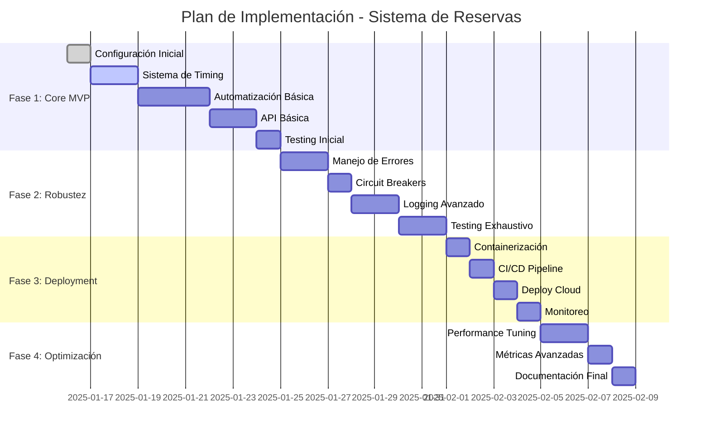

# Plan de Implementación y Roadmap

## 1. Estrategia de Desarrollo

### 1.1 Metodología de Desarrollo

**Enfoque**: Iterativo e incremental con foco en MVP (Minimum Viable Product)

**Principios Guía**:
- **Time-to-Market Rápido**: Funcionalidad básica operativa en 1-2 semanas
- **Iteración Basada en Feedback**: Mejoras continuas basadas en uso real
- **Risk-First Development**: Abordar primero los componentes de mayor riesgo
- **Simplicidad Primero**: Implementar la solución más simple que funcione

### 1.2 Fases de Desarrollo



## 2. Fase 1: MVP Core (Semana 1)

### 2.1 Día 1: Configuración del Proyecto

#### Objetivos
- ✅ Estructura básica del proyecto
- ✅ Configuración de entorno de desarrollo
- ✅ Dependencias principales instaladas

#### Tareas Específicas

**Setup del Proyecto**
```bash
# Estructura de directorios
mkdir -p src/{core,services,utils,config}
mkdir -p tests/{unit,integration,e2e}
mkdir -p config/{environments}
mkdir -p logs
mkdir -p docs/diagrams
```

**Configuración de Dependencias**
```toml
# pyproject.toml
[tool.poetry]
name = "boxmagic-reserva"
version = "0.1.0"
description = "Sistema automático de reserva de clases BoxMagic"

[tool.poetry.dependencies]
python = "^3.11"
fastapi = "^0.104.1"
uvicorn = "^0.24.0"
playwright = "^1.40.0"
apscheduler = "^3.10.4"
pydantic = "^2.4.2"
loguru = "^0.7.2"
pendulum = "^2.1.2"
httpx = "^0.25.2"
psutil = "^5.9.6"

[tool.poetry.group.dev.dependencies]
pytest = "^7.4.3"
pytest-asyncio = "^0.21.1"
black = "^23.10.1"
flake8 = "^6.1.0"
mypy = "^1.6.1"
```

**Configuración Base**
```python
# src/config/settings.py
from pydantic import BaseSettings
from typing import Dict, Any

class Settings(BaseSettings):
    # Configuración básica
    app_name: str = "BoxMagic Reserva"
    version: str = "0.1.0"
    timezone: str = "America/Santiago"
    
    # Configuración de BoxMagic
    boxmagic_url: str
    boxmagic_email: str
    boxmagic_password: str
    
    # Configuración de timing
    reservation_offset_hours: int = 25
    preparation_minutes: int = 2
    navigation_buffer_seconds: int = 60
    
    # Configuración de browser
    browser_headless: bool = True
    browser_timeout: int = 30000
    
    class Config:
        env_file = ".env"
```

#### Entregables
- ✅ Repositorio Git configurado
- ✅ Estructura de proyecto establecida
- ✅ Dependencias instaladas y funcionando
- ✅ Configuración base implementada

### 2.2 Días 2-3: Sistema de Timing Crítico

#### Objetivos
- ✅ Implementar servicio de sincronización temporal
- ✅ Desarrollar scheduler de precisión
- ✅ Integrar compensación de deriva temporal

#### Implementación del Timing Service

```python
# src/services/timing_service.py
import ntplib
import pendulum
from typing import Optional
import asyncio

class TimingService:
    """
    Servicio de timing crítico para reservas exactas
    """
    
    def __init__(self):
        self.ntp_servers = [
            "pool.ntp.org",
            "time.google.com", 
            "time.cloudflare.com"
        ]
        self.drift_compensation = 0.0
        self.last_sync = None
    
    async def get_precise_time(self) -> pendulum.DateTime:
        """Obtener tiempo preciso con compensación"""
        current_time = pendulum.now("America/Santiago")
        return current_time.add(seconds=self.drift_compensation)
    
    async def sync_with_ntp(self) -> bool:
        """Sincronizar con servidor NTP"""
        for server in self.ntp_servers:
            try:
                client = ntplib.NTPClient()
                response = await asyncio.to_thread(
                    client.request, server, timeout=5
                )
                
                ntp_time = pendulum.from_timestamp(response.tx_time)
                local_time = pendulum.now("America/Santiago")
                
                self.drift_compensation = (ntp_time - local_time).total_seconds()
                self.last_sync = local_time
                
                return True
                
            except Exception as e:
                continue
        
        return False
    
    def calculate_reservation_time(self, class_start_time: str) -> pendulum.DateTime:
        """Calcular tiempo exacto de reserva (25 horas antes)"""
        # Parsing de tiempo de clase (formato "HH:MM")
        hour, minute = map(int, class_start_time.split(":"))
        
        # Clase es mañana
        tomorrow = pendulum.tomorrow("America/Santiago")
        class_datetime = tomorrow.replace(hour=hour, minute=minute, second=0, microsecond=0)
        
        # Reserva es 25 horas antes
        reservation_time = class_datetime.subtract(hours=25)
        
        return reservation_time
```

#### Sistema de Scheduler de Precisión

```python
# src/services/scheduler_service.py
from apscheduler.schedulers.asyncio import AsyncIOScheduler
from apscheduler.triggers.date import DateTrigger
import asyncio

class PrecisionScheduler:
    """
    Scheduler de alta precisión para reservas
    """
    
    def __init__(self, timing_service: TimingService):
        self.scheduler = AsyncIOScheduler(timezone="America/Santiago")
        self.timing_service = timing_service
        self.active_jobs = {}
    
    async def start(self):
        """Iniciar scheduler"""
        self.scheduler.start()
        
        # Job de sincronización NTP cada hora
        self.scheduler.add_job(
            self.timing_service.sync_with_ntp,
            'interval',
            hours=1,
            id='ntp_sync'
        )
    
    async def schedule_reservation(self, class_config: Dict) -> str:
        """Programar una reserva"""
        reservation_time = self.timing_service.calculate_reservation_time(
            class_config['start_time']
        )
        
        # Programar preparación 2 minutos antes
        prep_time = reservation_time.subtract(minutes=2)
        
        job_id = f"reservation_{class_config['day']}_{class_config['start_time']}"
        
        self.scheduler.add_job(
            self._execute_reservation_preparation,
            DateTrigger(run_date=prep_time.to_datetime_string()),
            args=[class_config, reservation_time],
            id=job_id
        )
        
        self.active_jobs[job_id] = {
            'class_config': class_config,
            'reservation_time': reservation_time,
            'status': 'scheduled'
        }
        
        return job_id
    
    async def _execute_reservation_preparation(self, class_config, reservation_time):
        """Ejecutar preparación de reserva"""
        # Este método será implementado en la siguiente fase
        pass
```

#### Entregables
- ✅ Servicio de timing con sincronización NTP
- ✅ Scheduler de precisión funcionando
- ✅ Cálculo correcto de tiempos de reserva
- ✅ Tests unitarios básicos

### 2.3 Días 4-6: Automatización Web Básica

#### Objetivos
- ✅ Implementar navegación básica en BoxMagic
- ✅ Desarrollar flujo de login automático
- ✅ Crear sistema de localización de elementos
- ✅ Implementar ejecución de reserva

#### Implementación del Browser Manager

```python
# src/services/browser_manager.py
from playwright.async_api import async_playwright
import asyncio

class BrowserManager:
    """
    Gestor de browser para automatización web
    """
    
    def __init__(self, headless: bool = True):
        self.headless = headless
        self.browser = None
        self.context = None
        self.page = None
    
    async def initialize(self):
        """Inicializar browser"""
        self.playwright = await async_playwright().start()
        
        self.browser = await self.playwright.chromium.launch(
            headless=self.headless,
            args=[
                '--disable-dev-shm-usage',
                '--disable-gpu',
                '--no-sandbox',
                '--disable-setuid-sandbox'
            ]
        )
        
        self.context = await self.browser.new_context(
            viewport={'width': 1280, 'height': 720},
            user_agent='Mozilla/5.0 (Macintosh; Intel Mac OS X 10_15_7) AppleWebKit/537.36'
        )
        
        self.page = await self.context.new_page()
    
    async def close(self):
        """Cerrar browser"""
        if self.browser:
            await self.browser.close()
        if self.playwright:
            await self.playwright.stop()
```

#### Implementación del Reservation Engine

```python
# src/services/reservation_engine.py
class ReservationEngine:
    """
    Motor de reservas automáticas
    """
    
    def __init__(self, browser_manager: BrowserManager, timing_service: TimingService):
        self.browser = browser_manager
        self.timing = timing_service
    
    async def execute_reservation(self, class_config: Dict, reservation_time: pendulum.DateTime):
        """Ejecutar proceso completo de reserva"""
        try:
            # Fase 1: Navegación y login
            await self._navigation_phase(class_config)
            
            # Fase 2: Preparación de reserva
            await self._preparation_phase(class_config)
            
            # Fase 3: Espera precisa
            await self._precise_waiting_phase(reservation_time)
            
            # Fase 4: Ejecución
            result = await self._execution_phase()
            
            return result
            
        except Exception as e:
            logger.error(f"Reservation failed: {e}")
            raise
    
    async def _navigation_phase(self, class_config):
        """Navegación y login"""
        # Ir a página de login
        await self.browser.page.goto(BOXMAGIC_URL)
        
        # Login
        await self.browser.page.fill("input[type='email']", EMAIL)
        await self.browser.page.fill("input[type='password']", PASSWORD)
        await self.browser.page.click("button[type='submit']")
        
        # Esperar redirección
        await self.browser.page.wait_for_url("**/dashboard", timeout=10000)
    
    async def _preparation_phase(self, class_config):
        """Preparación para reserva"""
        # Navegar a clases
        await self.browser.page.click("text=Clases")
        
        # Seleccionar día siguiente
        tomorrow_selector = self._get_tomorrow_selector()
        await self.browser.page.click(tomorrow_selector)
        
        # Localizar clase
        class_selector = f"text={class_config['class_name']} {class_config['start_time']}"
        await self.browser.page.click(class_selector)
        
        # Esperar popup de reserva
        await self.browser.page.wait_for_selector("text=Reservar")
    
    async def _precise_waiting_phase(self, target_time):
        """Espera hasta momento exacto"""
        while True:
            current_time = await self.timing.get_precise_time()
            time_diff = (target_time - current_time).total_seconds()
            
            if time_diff <= 0:
                break
            elif time_diff < 0.1:
                await asyncio.sleep(0.01)  # 10ms precision
            elif time_diff < 1:
                await asyncio.sleep(0.1)   # 100ms precision
            else:
                await asyncio.sleep(0.5)   # 500ms precision
    
    async def _execution_phase(self):
        """Ejecutar click de reserva"""
        await self.browser.page.click("text=Reservar")
        
        # Verificar éxito
        try:
            await self.browser.page.wait_for_selector(
                "text=Reserva confirmada", 
                timeout=5000
            )
            return {"success": True, "message": "Reserva exitosa"}
        except:
            return {"success": False, "message": "Reserva falló"}
```

#### Entregables
- ✅ Browser manager funcional
- ✅ Navegación automática en BoxMagic
- ✅ Motor de reservas básico operativo
- ✅ Tests de integración básicos

### 2.4 Días 7-8: API y Testing Inicial

#### Objetivos
- ✅ Implementar API REST básica
- ✅ Integrar todos los componentes
- ✅ Realizar testing end-to-end
- ✅ Documentar APIs

#### Implementación de FastAPI

```python
# src/main.py
from fastapi import FastAPI, HTTPException
from pydantic import BaseModel
import asyncio

app = FastAPI(title="BoxMagic Reserva", version="0.1.0")

class ReservationRequest(BaseModel):
    day: str
    class_name: str
    start_time: str
    end_time: str

@app.on_event("startup")
async def startup_event():
    """Inicializar servicios"""
    global timing_service, scheduler_service, browser_manager, reservation_engine
    
    timing_service = TimingService()
    await timing_service.sync_with_ntp()
    
    scheduler_service = PrecisionScheduler(timing_service)
    await scheduler_service.start()
    
    browser_manager = BrowserManager()
    await browser_manager.initialize()
    
    reservation_engine = ReservationEngine(browser_manager, timing_service)

@app.get("/health")
async def health_check():
    """Health check endpoint"""
    return {
        "status": "healthy",
        "version": "0.1.0",
        "timestamp": pendulum.now().isoformat()
    }

@app.post("/schedule/reservation")
async def schedule_reservation(request: ReservationRequest):
    """Programar una reserva"""
    try:
        job_id = await scheduler_service.schedule_reservation(request.dict())
        return {"job_id": job_id, "status": "scheduled"}
    except Exception as e:
        raise HTTPException(status_code=500, detail=str(e))

@app.get("/status/reservations")
async def get_reservation_status():
    """Obtener estado de reservas"""
    return {"active_jobs": scheduler_service.active_jobs}
```

#### Testing End-to-End

```python
# tests/e2e/test_reservation_flow.py
import pytest
import asyncio

@pytest.mark.asyncio
async def test_complete_reservation_flow():
    """Test del flujo completo de reserva"""
    
    # Configurar test
    class_config = {
        "day": "monday",
        "class_name": "CrossFit",
        "start_time": "08:00",
        "end_time": "09:00"
    }
    
    # Programar reserva de prueba (en 2 minutos)
    test_time = pendulum.now().add(minutes=2)
    
    # Ejecutar reserva
    result = await reservation_engine.execute_reservation(
        class_config, 
        test_time
    )
    
    # Verificar resultado
    assert result["success"] == True
    assert "Reserva exitosa" in result["message"]
```

#### Entregables
- ✅ API REST funcional
- ✅ Sistema integrado operativo
- ✅ Tests end-to-end pasando
- ✅ MVP funcional completado

## 3. Fase 2: Robustez y Confiabilidad (Semana 2)

### 3.1 Días 9-10: Manejo Avanzado de Errores

#### Objetivos
- ✅ Implementar sistema robusto de manejo de errores
- ✅ Desarrollar mecanismos de recuperación automática
- ✅ Integrar circuit breakers y retry logic

#### Implementación Detallada
```python
# src/services/error_handler.py
class ErrorHandler:
    """Sistema centralizado de manejo de errores"""
    
    async def handle_navigation_error(self, error, context):
        """Manejar errores de navegación con recuperación"""
        if isinstance(error, ElementNotFoundError):
            return await self._handle_missing_element(error, context)
        elif isinstance(error, TimeoutError):
            return await self._handle_timeout(error, context)
        else:
            return await self._handle_generic_error(error, context)
```

### 3.2 Días 11-12: Logging y Observabilidad

#### Objetivos
- ✅ Implementar logging estructurado
- ✅ Desarrollar métricas de performance
- ✅ Crear dashboards básicos de monitoreo

### 3.3 Días 13-14: Testing Exhaustivo

#### Objetivos
- ✅ Tests de carga y estrés
- ✅ Simulación de fallas
- ✅ Validación de timing accuracy

## 4. Fase 3: Deployment (Semana 3)

### 4.1 Containerización y CI/CD

#### Dockerfile Optimizado
```dockerfile
FROM python:3.11-slim

# Instalar dependencias del sistema
RUN apt-get update && apt-get install -y \
    wget \
    gnupg \
    && rm -rf /var/lib/apt/lists/*

# Instalar Poetry
RUN pip install poetry

# Copiar archivos de dependencias
COPY pyproject.toml poetry.lock ./

# Instalar dependencias
RUN poetry config virtualenvs.create false \
    && poetry install --no-dev

# Instalar Playwright browsers
RUN playwright install chromium

# Copiar código de aplicación
COPY src/ ./src/
COPY config/ ./config/

# Configurar variables de entorno
ENV PYTHONPATH=/app/src
ENV TZ=America/Santiago

# Exponer puerto
EXPOSE 8080

# Comando de inicio
CMD ["uvicorn", "main:app", "--host", "0.0.0.0", "--port", "8080"]
```

### 4.2 Deploy en fly.io

#### Configuración de Deployment
```yaml
# .github/workflows/deploy.yml
name: Deploy to fly.io

on:
  push:
    branches: [main]

jobs:
  deploy:
    runs-on: ubuntu-latest
    steps:
      - uses: actions/checkout@v3
      
      - name: Deploy to fly.io
        uses: superfly/flyctl-actions/setup-flyctl@master
        
      - run: flyctl deploy --remote-only
        env:
          FLY_API_TOKEN: ${{ secrets.FLY_API_TOKEN }}
```

## 5. Métricas de Éxito por Fase

### Fase 1 MVP
- ✅ Reserva exitosa en ambiente de desarrollo
- ✅ Timing accuracy < 1 segundo
- ✅ API respondiendo correctamente

### Fase 2 Robustez  
- ✅ Tasa de éxito > 90% en tests de carga
- ✅ Recuperación automática de 80% de errores
- ✅ Logs estructurados funcionando

### Fase 3 Deployment
- ✅ Aplicación desplegada y accesible
- ✅ Monitoreo en funcionamiento  
- ✅ Reservas exitosas en producción

### Fase 4 Optimización
- ✅ Timing accuracy < 100ms
- ✅ Tasa de éxito > 95%
- ✅ Documentación completa

## 6. Recursos y Dependencias

### Recursos Técnicos Necesarios
- **Servidor Cloud**: fly.io (o similar)
- **Dominio**: Opcional para API
- **Monitoreo**: Logs integrados inicialmente

### Dependencias Externas
- **BoxMagic Website**: Disponibilidad y estabilidad
- **NTP Servers**: Para sincronización temporal
- **Internet**: Conectividad estable

### Riesgos y Mitigaciones
- **Cambios en UI de BoxMagic**: Selectores alternativos y monitoreo
- **Latencia de Red**: Compensación automática y múltiples servidores
- **Fallas de Infrastructure**: Health checks y auto-restart

Este plan proporciona una ruta clara y ejecutable para desarrollar el sistema de reservas automáticas, con hitos claros y criterios de éxito medibles en cada fase.
