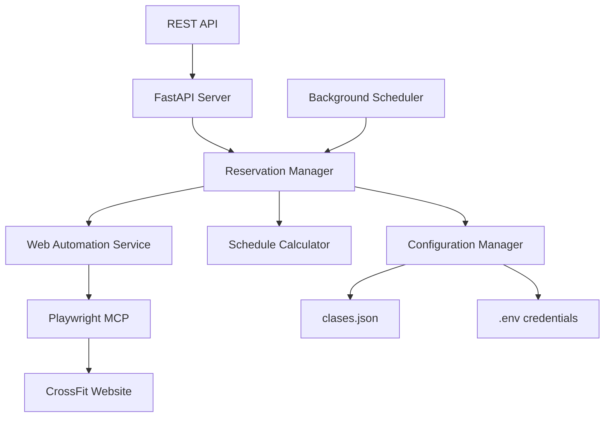
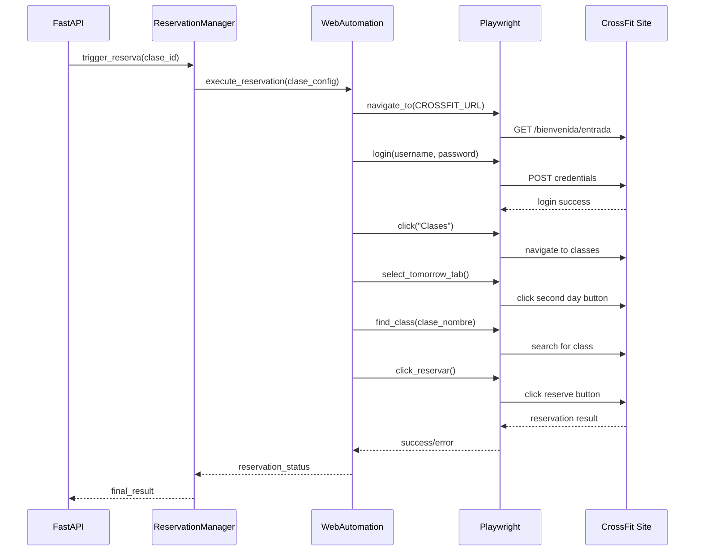
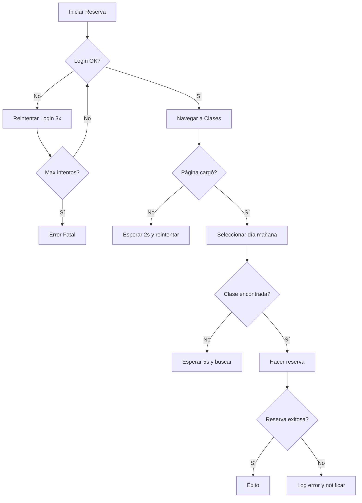

# Documento de Diseño - Sistema de Reservas CrossFit MVP

## 1. Resumen Ejecutivo

### Problema
Las clases de CrossFit tienen cupos limitados que se agotan en segundos. La reserva se habilita exactamente 25 horas antes del inicio de la clase, requiriendo precisión temporal para asegurar un cupo.

### Solución Propuesta
Sistema automatizado de reservas usando FastAPI + Playwright que:
- Lee configuración de clases desde `clases.json`
- Automatiza el flujo de navegación web para reservar
- Calcula timing preciso para ejecutar reservas en el momento exacto

### Stack Tecnológico
- **Backend**: Python + FastAPI
- **Automatización Web**: MCP Playwright
- **Configuración**: JSON
- **Scheduling**: Python nativo (datetime/time)

## 2. Análisis de Requerimientos

### Funcionales
1. **RF-001**: Lectura de configuración de clases desde JSON
2. **RF-002**: Login automatizado en el sitio web
3. **RF-003**: Navegación a sección "Clases"
4. **RF-004**: Selección automática del día siguiente
5. **RF-005**: Búsqueda y selección de clase específica
6. **RF-006**: Ejecución de reserva
7. **RF-007**: Cálculo de timing para reserva (25h antes - 2min preparación)
8. **RF-008**: API REST para trigger manual de reservas

### No Funcionales
1. **RNF-001**: Precisión temporal ±1 segundo
2. **RNF-002**: Manejo de errores de navegación
3. **RNF-003**: Logging detallado de operaciones
4. **RNF-004**: Configuración externa de credenciales

## 3. Arquitectura del Sistema

### Componentes Principales



### Estructura de Directorios
```
crossfit-reservas/
├── app/
│   ├── __init__.py
│   ├── main.py                 # FastAPI app
│   ├── models/
│   │   ├── __init__.py
│   │   ├── clase.py           # Modelo de clase
│   │   └── reserva.py         # Modelo de reserva
│   ├── services/
│   │   ├── __init__.py
│   │   ├── reservation_manager.py
│   │   ├── web_automation.py
│   │   ├── schedule_calculator.py
│   │   └── config_manager.py
│   ├── api/
│   │   ├── __init__.py
│   │   └── reservas.py        # Endpoints
│   └── utils/
│       ├── __init__.py
│       └── logger.py
├── config/
│   ├── clases.json
│   └── .env
├── tests/
├── requirements.txt
└── README.md
```

## 4. Modelos de Datos

### Modelo Clase (clases.json)
```json
{
  "clases": [
    {
      "id": "competitor-1800",
      "nombre": "Competitor 18:00-19:00",
      "dia_semana": "jueves",
      "hora_inicio": "18:00",
      "hora_reserva": "17:00",
      "activo": true
    },
    {
      "id": "crossfit-1700",
      "nombre": "17:00 CrossFit 17:00-18:00",
      "dia_semana": "jueves", 
      "hora_inicio": "17:00",
      "hora_reserva": "16:00",
      "activo": true
    }
  ]
}
```

### Modelo Reserva
```python
from pydantic import BaseModel
from datetime import datetime
from enum import Enum

class EstadoReserva(str, Enum):
    PENDIENTE = "pendiente"
    EN_PROCESO = "en_proceso"
    EXITOSA = "exitosa"
    FALLIDA = "fallida"

class ReservaRequest(BaseModel):
    clase_id: str
    ejecutar_inmediato: bool = False

class ReservaResponse(BaseModel):
    id: str
    clase_nombre: str
    estado: EstadoReserva
    fecha_ejecucion: datetime
    mensaje: str
```

## 5. Flujo de Navegación Web



## 6. API Endpoints

### Endpoints MVP

```python
# Reserva inmediata (MVP Fase 1)
POST /api/reservas/ejecutar
{
    "clase_id": "competitor-1800",
    "ejecutar_inmediato": true
}

# Programar reserva (MVP Fase 2)
POST /api/reservas/programar
{
    "clase_id": "crossfit-1700",
    "ejecutar_inmediato": false
}

# Estado de reservas
GET /api/reservas/estado/{reserva_id}

# Listar clases configuradas
GET /api/clases

# Health check
GET /api/health
```

## 7. Cálculo de Timing

```mermaid
gantt
    title Timeline de Reserva
    dateFormat HH:mm
    axisFormat %H:%M
    
    section Miércoles
    Clase Jueves 17:00    :milestone, m1, 16:00, 0d
    Reserva disponible    :crit, 16:00, 16:00
    
    section Jueves  
    Inicio navegación     :active, 16:58, 2m
    Ejecución reserva     :crit, 17:00, 1m
    Clase inicia          :milestone, m2, 17:00, 0d
```

### Lógica de Cálculo
```python
def calcular_momento_reserva(clase_config):
    """
    Calcula cuándo iniciar el proceso de reserva
    25 horas antes - 2 minutos de preparación
    """
    hora_inicio = datetime.strptime(clase_config.hora_inicio, "%H:%M")
    fecha_clase = calcular_fecha_clase(clase_config.dia_semana)
    momento_clase = datetime.combine(fecha_clase, hora_inicio.time())
    
    # 25 horas antes
    momento_reserva = momento_clase - timedelta(hours=25)
    
    # 2 minutos antes para preparación
    momento_inicio_proceso = momento_reserva - timedelta(minutes=2)
    
    return momento_inicio_proceso, momento_reserva
```

## 8. Manejo de Errores

### Tipos de Errores
1. **Error de Login**: Credenciales incorrectas
2. **Error de Navegación**: Elementos no encontrados
3. **Error de Timing**: Reserva no disponible aún
4. **Error de Capacidad**: Clase llena
5. **Error de Red**: Problemas de conectividad

### Estrategias de Recuperación


## 9. Plan de Implementación

### Fase 1: MVP Básico (Semana 1)
- [x] Configuración del proyecto
- [ ] Modelos de datos básicos
- [ ] API REST con FastAPI
- [ ] Servicio de automatización web básico
- [ ] Endpoint de reserva inmediata
- [ ] Configuración desde JSON

### Fase 2: Timing Automático (Semana 2)
- [ ] Calculadora de scheduling
- [ ] Background tasks para reservas programadas
- [ ] Manejo robusto de errores
- [ ] Logging completo
- [ ] Tests unitarios básicos

### Fase 3: Mejoras (Semana 3+)
- [ ] Interfaz web simple
- [ ] Notificaciones (email/webhook)
- [ ] Métricas y monitoreo
- [ ] Configuración múltiples clases por día
- [ ] Backup y recovery de fallos

## 10. Consideraciones Técnicas

### Seguridad
- Credenciales en variables de entorno
- No logging de passwords
- Rate limiting en API
- Validación de inputs

### Performance
- Pool de conexiones Playwright
- Timeouts configurables
- Cleanup de recursos
- Manejo de memoria

### Monitoring
- Logs estructurados (JSON)
- Métricas de tiempo de ejecución
- Status health checks
- Alertas por fallos críticos

## 11. Preguntas para Validar

1. **¿La estructura del JSON de clases es adecuada?** ¿Necesitas campos adicionales?

2. **¿El endpoint inmediato es suficiente para el MVP?** ¿O prefieres directamente el scheduling automático?

3. **¿Necesitas notificaciones cuando se complete/falle una reserva?** ¿Email, webhook, logs?

4. **¿Qué nivel de logs necesitas?** ¿Solo errores o también debug completo?

5. **¿Manejar múltiples clases por día desde el inicio?** ¿O una por vez es suficiente?

---

**Próximo Paso**: Una vez validado este diseño, procederemos con la implementación comenzando por la estructura base del proyecto y el endpoint de reserva inmediata.
