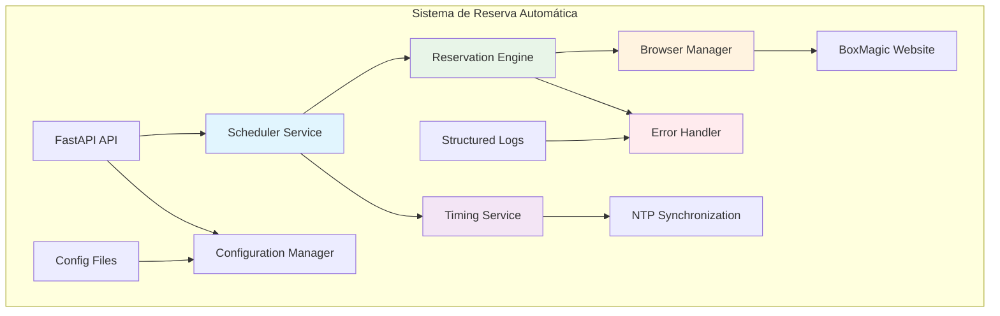

# Arquitectura de Alto Nivel

## Componentes del Sistema

### Scheduler Service
- **Función**: Orquestación temporal de reservas
- **Responsabilidades**: 
  - Calcular timing de reservas (25 horas antes)
  - Ejecutar procesos en momento exacto
  - Gestionar cola de reservas pendientes

### Timing Service  
- **Función**: Precisión temporal crítica
- **Responsabilidades**:
  - Sincronización con servidores NTP
  - Compensación de deriva temporal
  - Conversión de zonas horarias

### Reservation Engine
- **Función**: Motor de automatización de reservas
- **Responsabilidades**:
  - Navegación automática en BoxMagic
  - Ejecución de reservas en timing exacto
  - Gestión de estados de reserva

### Browser Manager
- **Función**: Gestión del navegador Chromium
- **Responsabilidades**:
  - Inicialización y configuración de browser
  - Gestión de contextos y páginas
  - Optimización de performance

### Error Handler
- **Función**: Recuperación automática de fallas
- **Responsabilidades**:
  - Detección y clasificación de errores
  - Estrategias de recuperación automática
  - Circuit breakers y fallbacks
