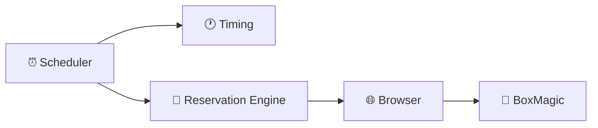
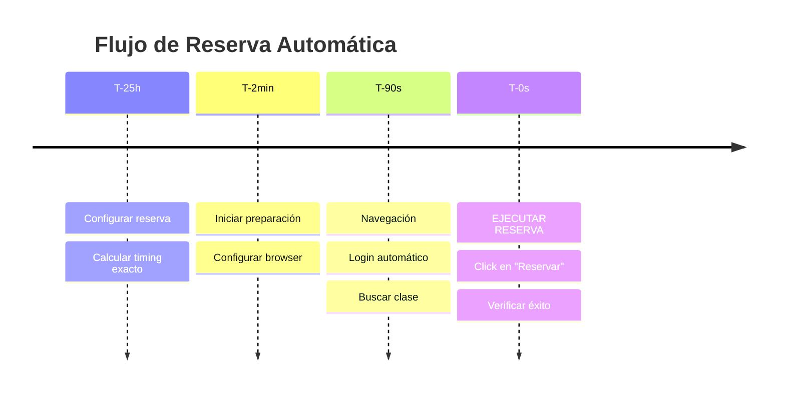
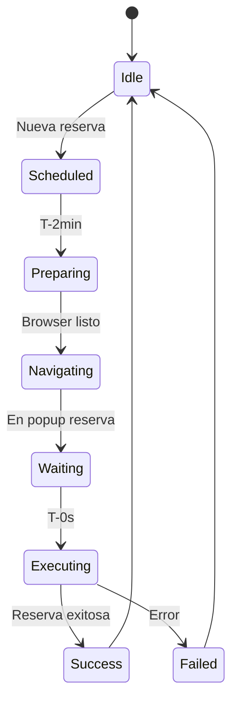
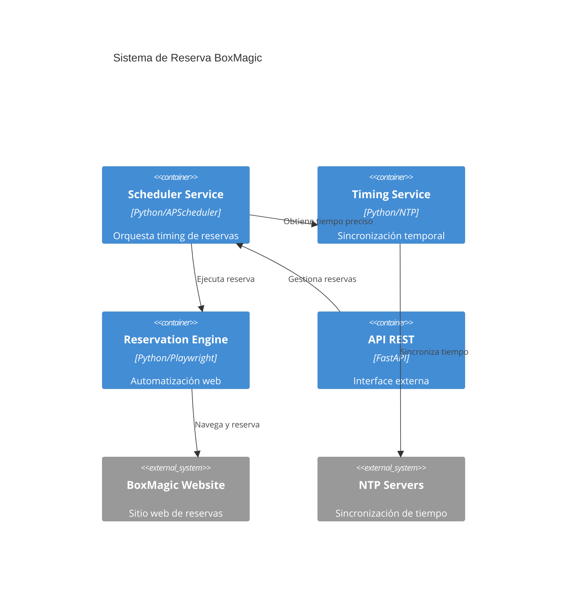

# 🧪 Demo de Diagramas - Prueba de Visualización

## Instrucciones Rápidas

1. **Abre este archivo en VS Code**
2. **Presiona `Ctrl+Shift+V`** (Windows/Linux) o `Cmd+Shift+V` (Mac) para vista previa
3. **O presiona `Ctrl+K V`** para vista lado a lado

## Diagrama 1: Arquitectura Simplificada

### Versión Visual ASCII
```
┌─────────────┐    ┌─────────────┐    ┌─────────────┐
│  ⏰ Scheduler │───▶│ 🕐 Timing   │    │             │
│             │    │  Service    │    │             │
└─────────────┘    └─────────────┘    │             │
       │                              │             │
       ▼                              │             │
┌─────────────┐    ┌─────────────┐    │ 📱 BoxMagic │
│ 🤖 Reservation│───▶│ 🌐 Browser  │───▶│  Website    │
│   Engine    │    │  Manager    │    │             │
└─────────────┘    └─────────────┘    └─────────────┘
```

### Versión Mermaid (para copiar a mermaid.live)


## Diagrama 2: Flujo Temporal

### Versión Visual
```
Timeline de Reserva Automática:

T-25h ──┐
        │ • Configurar reserva
        │ • Calcular timing exacto
        │
T-2min ─┤
        │ • Iniciar preparación  
        │ • Configurar browser
        │
T-90s ──┤
        │ • Navegación
        │ • Login automático
        │ • Buscar clase
        │
T-0s ───┤
        │ • ⚡ EJECUTAR RESERVA ⚡
        │ • Click en "Reservar"
        │ • Verificar éxito
```

### Código Mermaid Original


## Diagrama 3: Estados del Sistema

### Versión Visual
```
Estados del Sistema de Reserva:

    [Inicio] ──▶ (Idle)
                   │
                   ▼ Nueva reserva
              (Scheduled)
                   │
                   ▼ T-2min
              (Preparing)
                   │
                   ▼ Browser listo
              (Navigating)
                   │
                   ▼ En popup reserva  
               (Waiting)
                   │
                   ▼ T-0s
              (Executing)
                   │
        ┌──────────┼──────────┐
        ▼          ▼          ▼
   (Success)   (Failed)   (Error)
        │          │          │
        └──────────┼──────────┘
                   ▼
                (Idle) ◀── Ciclo completo
```

### Código Mermaid


## Diagrama 4: Componentes del Sistema



---

## ✅ Verificación

Si puedes ver los diagramas arriba renderizados correctamente, entonces:

- ✅ Las extensiones están funcionando
- ✅ Puedes ver todos los diagramas del proyecto
- ✅ Estás listo para revisar la documentación completa

## 🔧 Solución de Problemas

**Los diagramas Mermaid no se ven? Aquí están las soluciones:**

### ✅ Opción 1: Usar Markdown Preview Enhanced (Instalada)
1. **Presiona `Ctrl+Shift+P`** (Cmd+Shift+P en Mac)
2. **Escribe**: "Markdown Preview Enhanced: Open Preview to the Side"
3. **Enter** - Debería renderizar los diagramas correctamente

### ✅ Opción 2: Editor Online (Más Confiable)
1. **Ve a**: https://mermaid.live/
2. **Copia cualquier código mermaid** de arriba
3. **Pégalo en el editor**
4. **Visualiza en tiempo real**

### ✅ Opción 3: Usar Diagramas ASCII (Arriba)
- Los diagramas ASCII se ven siempre
- No requieren extensiones
- Funcionan en cualquier editor

### ✅ Opción 4: Otras Extensiones
Si nada funciona, prueba:
```
1. "Mermaid Markdown Syntax Highlighting"
2. "Markdown All in One" 
3. "PlantUML"
```

### 🎯 Recomendación Final
**Para este proyecto, usa:**
1. **Diagramas ASCII** para documentación rápida
2. **mermaid.live** para diagramas complejos
3. **Markdown Preview Enhanced** en VS Code
