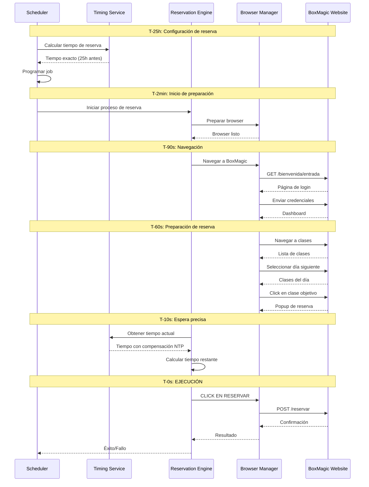

# Flujo de Reserva - Secuencia Temporal

## Timing Crítico del Proceso

### Fases Temporales

| **Fase** | **Timing** | **Duración** | **Actividad Principal** |
|----------|------------|--------------|-------------------------|
| **Configuración** | T-25h | Instantáneo | Calcular y programar reserva |
| **Preparación** | T-2min | 30s | Inicializar browser y contexto |
| **Navegación** | T-90s | 60s | Login y navegación a clases |
| **Posicionamiento** | T-30s | 20s | Localizar clase y abrir popup |
| **Espera Precisa** | T-10s | 10s | Monitoreo temporal fino |
| **Ejecución** | T-0s | <1s | Click en reservar |
| **Verificación** | T+1s | 5s | Confirmar éxito/fallo |

### Precisión Temporal

- **T-10s a T-1s**: Monitoreo cada 100ms
- **T-1s a T-0s**: Monitoreo cada 10ms  
- **T-0s**: Ejecución inmediata
- **Objetivo**: ±100ms de precisión
- **Aceptable**: ±500ms de precisión
