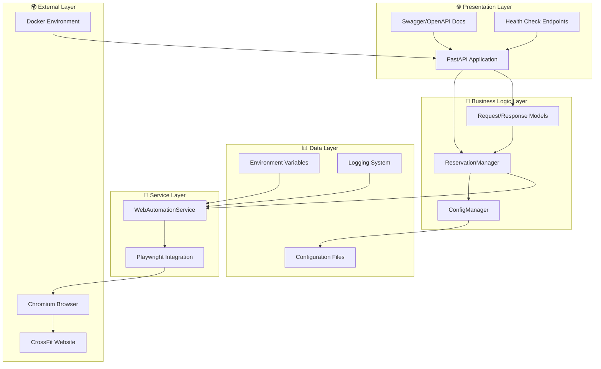
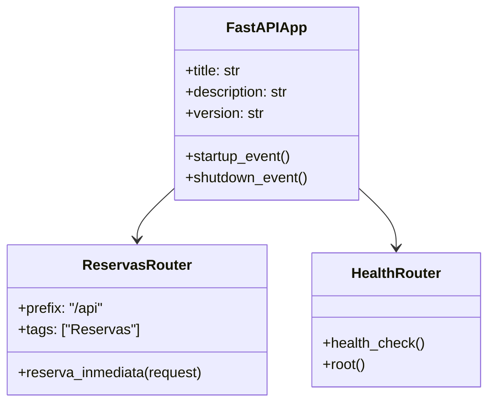
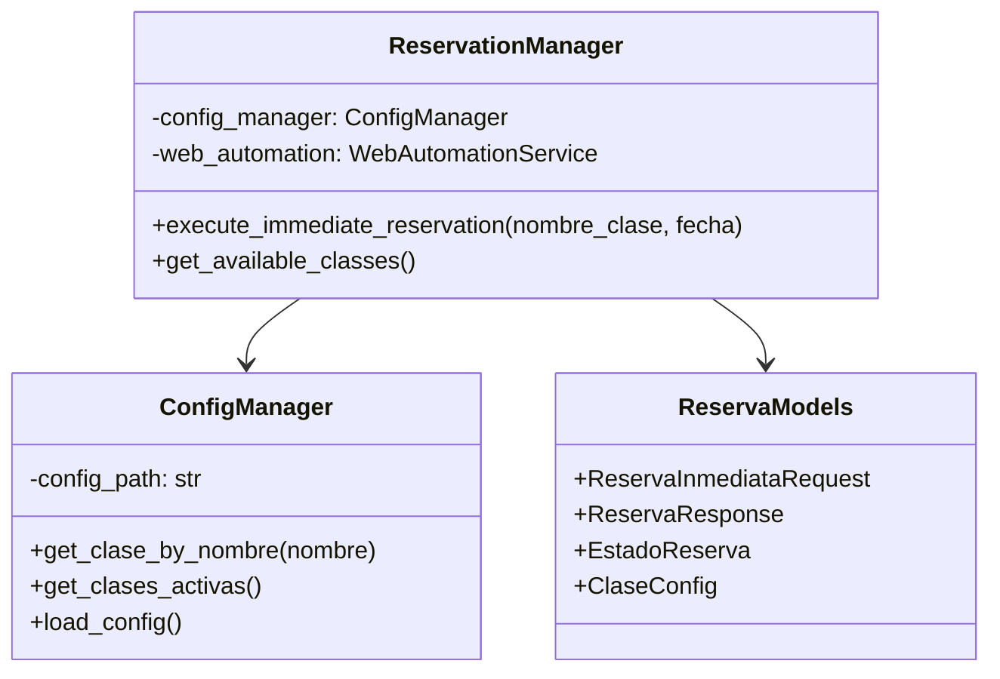
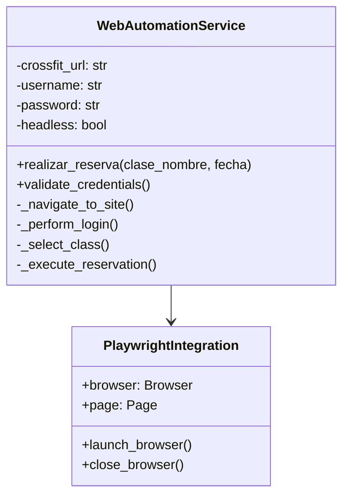
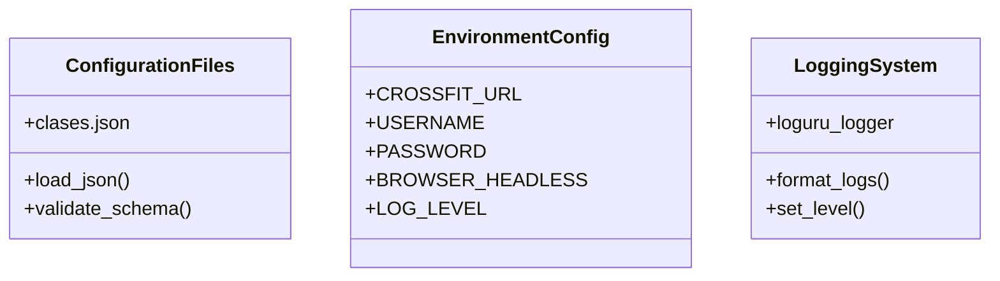
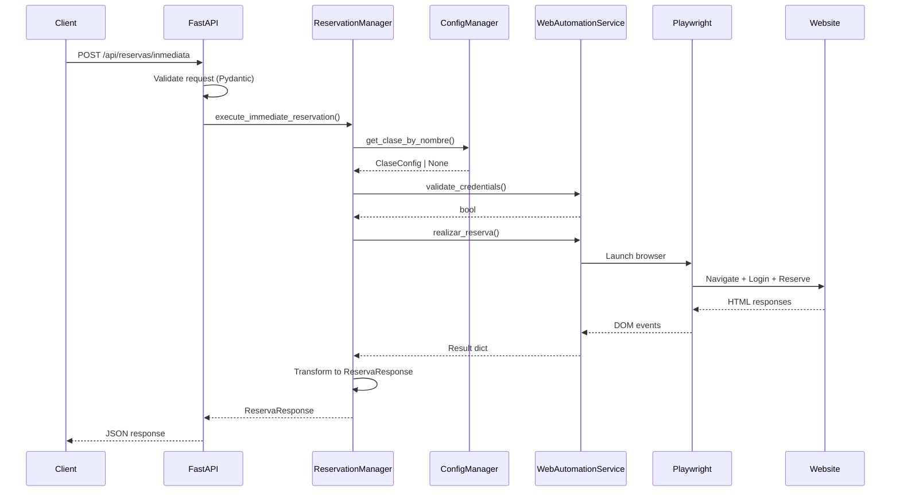
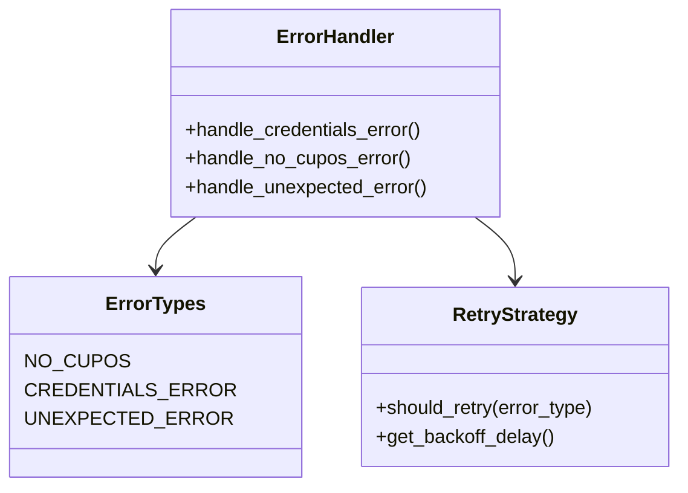
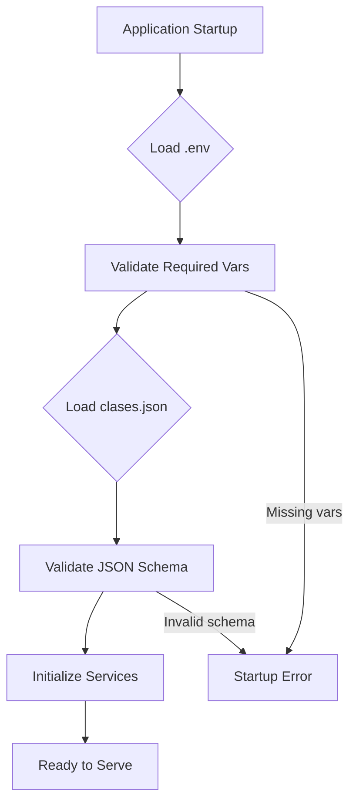
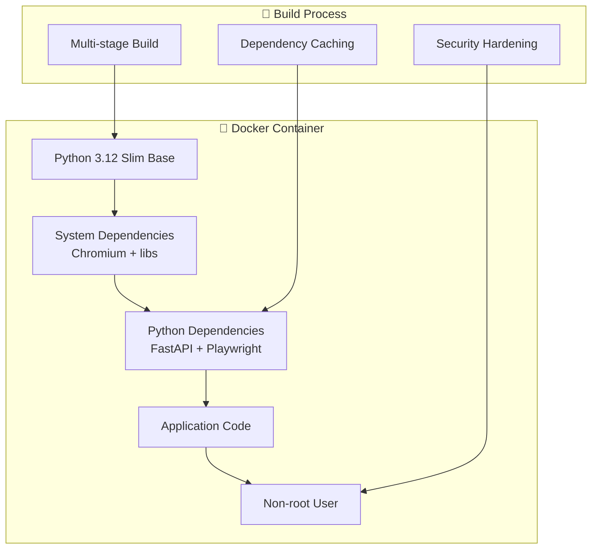

# 🏗️ Arquitectura del Sistema - Documentación Técnica

## Resumen Arquitectónico

El sistema CrossFit Reservas MVP implementa una arquitectura en capas que separa claramente las responsabilidades entre la API, lógica de negocio y automatización web. Esta documentación describe la estructura, patrones de diseño y decisiones técnicas implementadas.

## 📐 Vista General de la Arquitectura



## 🎯 Patrón de Arquitectura: Layered Architecture

### Principios Aplicados

1. **Separation of Concerns**: Cada capa tiene una responsabilidad específica
2. **Dependency Inversion**: Las capas superiores dependen de abstracciones
3. **Single Responsibility**: Cada clase tiene una única razón para cambiar
4. **Don't Repeat Yourself**: Lógica común centralizada

## 📦 Componentes por Capa

### 🌐 Presentation Layer (API)



**Responsabilidades:**
- Recepción de requests HTTP
- Validación de entrada con Pydantic
- Serialización de respuestas JSON
- Documentación automática
- Manejo de CORS

**Archivos:**
- `app/main.py` - Aplicación principal
- `app/api/reservas.py` - Endpoints de reservas

### 🎯 Business Logic Layer



**Responsabilidades:**
- Orquestación del flujo de reserva
- Validación de reglas de negocio
- Gestión de configuración de clases
- Transformación de datos
- Logging de eventos importantes

**Archivos:**
- `app/services/reservation_manager.py` - Orquestador principal
- `app/services/config_manager.py` - Gestión de configuración
- `app/models/reserva.py` - Modelos de datos

### 🤖 Service Layer (Automation)



**Responsabilidades:**
- Automatización de navegación web
- Gestión del ciclo de vida del navegador
- Interacción con elementos DOM
- Manejo de errores de navegación
- Soporte multiidioma (ES/EN)

**Archivos:**
- `app/services/web_automation.py` - Automatización principal
- `app/services/mcp_automation.py` - Integración MCP (futuro)

### 📊 Data Layer



**Responsabilidades:**
- Persistencia de configuración
- Gestión de variables de entorno
- Sistema de logging estructurado
- Validación de datos de entrada

**Archivos:**
- `config/clases.json` - Configuración de clases
- `.env` - Variables de entorno
- Logging integrado en todos los servicios

## 🔄 Flujo de Datos



## 🛠️ Patrones de Diseño Implementados

### 1. **Facade Pattern**
`ReservationManager` actúa como fachada que simplifica las interacciones complejas:

```python
class ReservationManager:
    def execute_immediate_reservation(self, nombre_clase: str, fecha: str):
        # Orquesta múltiples servicios de forma simple
        config = self.config_manager.get_clase_by_nombre(nombre_clase)
        result = self.web_automation.realizar_reserva(nombre_clase, fecha)
        return self._transform_response(result)
```

### 2. **Strategy Pattern** 
Diferentes estrategias de detección basadas en el contexto:

```python
# Estrategia para modo headless vs visual
if self.headless:
    # Priorizar selectores en inglés
    await page.wait_for_selector('button:has-text("Book")')
else:
    # Priorizar selectores en español  
    await page.wait_for_selector('button:has-text("Reservar")')
```

### 3. **Factory Pattern**
Configuración dinámica del navegador:

```python
def create_browser_config(headless: bool) -> dict:
    if headless:
        return {
            'headless': True,
            'args': ['--no-sandbox', '--disable-gpu']
        }
    else:
        return {
            'headless': False, 
            'slow_mo': 50
        }
```

### 4. **Command Pattern**
Cada paso de automatización encapsulado:

```python
async def _step_1_navigate(self, page):
    """Comando: Navegar al sitio"""
    await page.goto(self.crossfit_url)
    
async def _step_2_login(self, page):  
    """Comando: Realizar login"""
    await self._fill_credentials(page)
    
async def _step_3_select_class(self, page, clase_nombre):
    """Comando: Seleccionar clase"""
    await page.click(f'text="{clase_nombre}"')
```

## 🔒 Manejo de Errores y Resilencia

### Jerarquía de Excepciones



### Estrategias de Recuperación

| Error Type | Strategy | Retry | Notification |
|------------|----------|--------|-------------|
| `NO_CUPOS` | Fail fast | ❌ No | ℹ️ Info |
| `CREDENTIALS_ERROR` | Fail fast | ❌ No | ⚠️ Warning |
| `UNEXPECTED_ERROR` | Graceful degradation | ✅ Yes | 🚨 Alert |

## 📊 Configuración y Extensibilidad

### Sistema de Configuración



### Puntos de Extensión

1. **Nuevos tipos de reserva:**
```python
# Agregar en reservation_manager.py
async def execute_scheduled_reservation(self, clase_id: str, schedule_time: datetime):
    # Implementar lógica de programación
    pass
```

2. **Nuevos proveedores de navegación:**
```python
# Crear nueva implementación
class SeleniumAutomationService(BaseAutomationService):
    async def realizar_reserva(self, clase_nombre: str, fecha: str):
        # Implementación con Selenium
        pass
```

3. **Nuevas fuentes de configuración:**
```python
# Implementar interfaz
class DatabaseConfigManager(BaseConfigManager):
    def get_clases_activas(self):
        # Cargar desde base de datos
        pass
```

## 🐳 Infraestructura y Deployment

### Containerización



### Optimizaciones de Contenedor

1. **Multi-stage build** para reducir tamaño final
2. **Dependency caching** para builds más rápidos  
3. **Non-root user** para seguridad
4. **Health checks** removidos para desarrollo

## 📈 Métricas y Observabilidad

### Logging Estructurado

```python
# Formato consistente en toda la aplicación
logger.info(f"🚀 Iniciando reserva para: {clase_nombre}")
logger.warning(f"⚠️ Sin cupos para: {clase_nombre}")  
logger.error(f"❌ Error en reserva: {error}")
logger.success(f"✅ Reserva exitosa: {clase_nombre}")
```

### Puntos de Instrumentación

1. **Request/Response timing**
2. **Browser automation steps**  
3. **Error rates por tipo**
4. **Success rates por clase/horario**

## 🚀 Roadmap Arquitectónico

### Fase 1: MVP Actual ✅
- API REST básica
- Automatización web
- Manejo de errores
- Dockerización

### Fase 2: Scheduler 🚧
- Sistema de cron jobs
- Persistencia de tareas  
- Notificaciones
- Dashboard básico

### Fase 3: Escalabilidad 📋
- Base de datos
- Cache (Redis)
- Queue system (Celery)
- Load balancing

### Fase 4: Observabilidad 📋
- Métricas (Prometheus)
- Tracing (Jaeger)
- Alerting (AlertManager)
- Dashboard (Grafana)

## 🔧 Decisiones Técnicas Clave

### 1. **FastAPI sobre Flask**
- ✅ Validación automática con Pydantic
- ✅ Documentación automática  
- ✅ Type hints nativo
- ✅ Performance superior

### 2. **Playwright sobre Selenium**
- ✅ Más rápido y estable
- ✅ Mejor soporte headless
- ✅ API más moderna
- ✅ Debugging tools integrados

### 3. **Docker Compose sobre K8s**
- ✅ Simplicidad para MVP
- ✅ Desarrollo local facilitado
- ✅ Menos overhead
- ✅ Migración futura posible

### 4. **Loguru sobre logging estándar**  
- ✅ Configuración más simple
- ✅ Formato más legible
- ✅ Colores en desarrollo
- ✅ Structured logging

## 🔐 Consideraciones de Seguridad

### Principios Aplicados

1. **Least Privilege**: Container no-root user
2. **Environment Isolation**: Variables sensibles en .env
3. **Input Validation**: Pydantic models
4. **Error Handling**: No exposición de detalles internos

### Vulnerabilidades Mitigadas

- ✅ **Injection attacks**: Validación de entrada
- ✅ **Privilege escalation**: Non-root container  
- ✅ **Information disclosure**: Logging sanitizado
- ✅ **CORS attacks**: Configuración restrictiva
