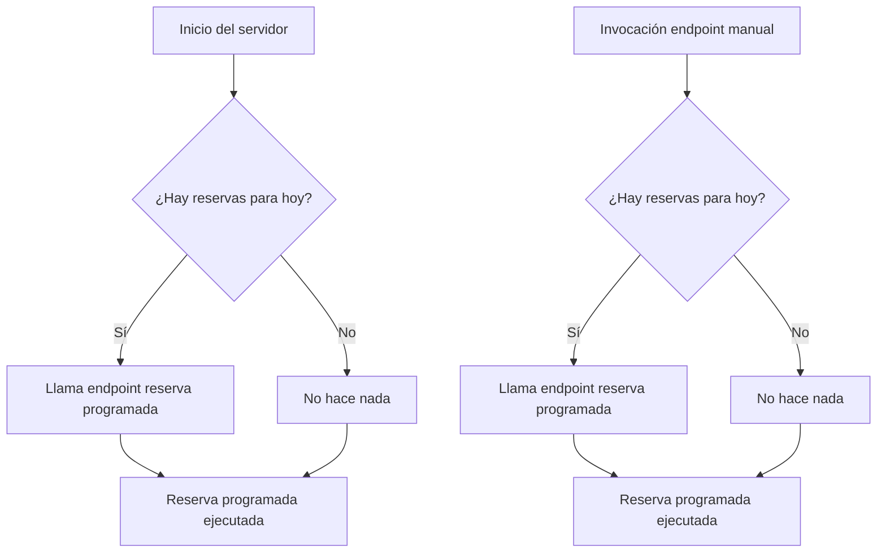
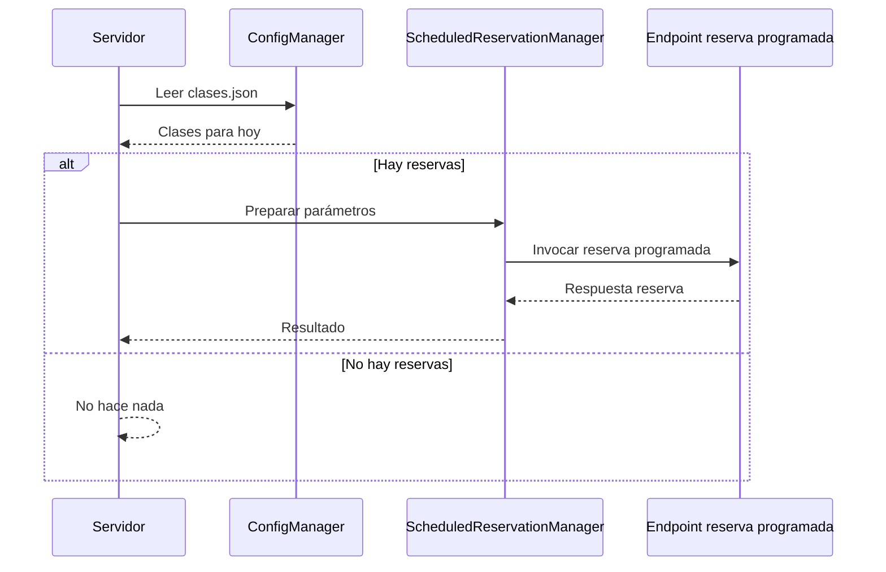

# Diseño de la Mejora: Punto de Entrada Principal para Reservas

## Resumen del Requerimiento

El objetivo es implementar un punto de entrada principal para la aplicación de reservas, que permita:

1. **Ejecución automática al iniciar el servidor:**
   - Al arrancar el servidor, el sistema debe revisar si hoy corresponde realizar alguna reserva (según la configuración en `/config/clases.json`).
   - Si corresponde, debe invocar el endpoint de reserva programada con los parámetros correctos.

2. **Nuevo endpoint de ejecución bajo demanda:**
   - Exponer un endpoint HTTP que permita ejecutar el mismo proceso anterior bajo demanda, para ser invocado desde herramientas externas.

## Flujo General



## Detalles de Implementación

### 1. Detección de reservas para hoy
- Leer `/config/clases.json`.
- Buscar en cada clase el campo `fecha_reserva` y comparar con el día de hoy (en español, e.g. "Sábado").
- **Comparar usando lower() o upper() para evitar problemas de mayúsculas/minúsculas.**
- Se recomienda mantener las palabras con tilde para consistencia y evitar ambigüedades.
- Si hay coincidencia y la clase está activa, preparar los parámetros para el endpoint de reserva programada.

### 2. Mapeo de parámetros
- `nombre_clase`: directo del JSON.
- `fecha_clase`: prefijo de dos letras en inglés + número de día de mañana (hoy + 1). Ejemplo: si hoy es sábado 26, enviar "su 27".
- `fecha_reserva`: fecha de hoy en formato `aaaa-mm-dd`.
- `hora_reserva`: del JSON, asegurando formato `hh:mm:ss`.
- `timezone`: fijo `America/Santiago`.

#### Tabla de mapeo días

| Español   | Inglés |
|-----------|--------|
| LUNES     | mo     |
| MARTES    | tu     |
| MIÉRCOLES | we     |
| JUEVES    | th     |
| VIERNES   | fr     |
| SÁBADO    | sa     |
| DOMINGO   | su     |

### 3. Invocación del endpoint de reserva programada
- Realizar una petición HTTP interna (o llamada directa si es posible) al endpoint `/api/reservas/programada` con los parámetros mapeados.

### 4. Nuevo endpoint de ejecución bajo demanda
- Exponer un endpoint, por ejemplo `/api/ejecutar-reservas-hoy`, que ejecute el mismo flujo anterior.

## Diagrama de Secuencia



## Consideraciones y Decisiones

- Se asume que solo habrá una clase activa por día para reservar.
- El endpoint de ejecución bajo demanda debe devolver el mismo resultado que el endpoint de reserva programada.
- El formato de hora en el JSON debe ser siempre `hh:mm:ss`. Si no, se puede normalizar, pero no es obligatorio.
- El logging adicional solo es necesario si aporta valor, ya que el endpoint de reserva programada ya genera logs.
- Si el endpoint de reserva programada falla, se retorna el mismo mensaje de error que dicho endpoint.
- Se recomienda mantener los nombres de los días con tilde y comparar usando lower() o upper() para robustez.

## Detalle Endpoint

Archivo: `reservas.py`

```python
@router.post("/reservas/programada", response_model=ReservaProgramadaResponse)
async def reserva_programada(request: ReservaProgramadaRequest):
    """
    Programa una reserva para ejecutarse en un momento exacto.
    
    Ejemplo de uso:
    {
        "nombre_clase": "18:00 CrossFit 18:00-19:00",
        "fecha_clase": "LU 21",
        "fecha_reserva": "2025-01-19",
        "hora_reserva": "17:00:00"
    }
    """
    try:
        # Ejecutar en background y devolver respuesta inmediata
        import asyncio
        
        # Crear la tarea en background (fire and forget)
        task = asyncio.create_task(
            scheduled_reservation_manager.execute_scheduled_reservation(request)
        )
        
        # Para MVP, devolvemos respuesta inmediata
        from datetime import datetime
        import uuid
        
        return ReservaProgramadaResponse(
            id=str(uuid.uuid4()),
            clase_nombre=request.nombre_clase,
            fecha_clase=request.fecha_clase,
            fecha_reserva=request.fecha_reserva,
            hora_reserva=request.hora_reserva,
            estado="programada",
            fecha_creacion=datetime.now(),
            fecha_ejecucion_programada=datetime.now(),
            fecha_ejecucion_real=None,
            mensaje="Reserva programada iniciada correctamente. El proceso se ejecutará en background.",
            tiempo_espera_segundos=0,
            error_type=None
        )
        
    except Exception as e:
        raise HTTPException(status_code=500, detail=f"Error programando reserva: {str(e)}")
```


## Referencias

- [req-principal.md](../../requerimiento/req-principal.md) con el que se creó esta documentacion.
- [scheduled_reservation_manager.py](../../app/services/scheduled_reservation_manager.py)
- [config_manager.py](../../app/services/config_manager.py)
- [main.py (app)](../../app/main.py)
- [reservas.py](../../app/api/reservas.py)
- [reserva.py](../../app/models/reserva.py)
- [preparation_service.py](../../app/services/preparation_service.py)

---

Este documento resume el diseño propuesto y actualizado para la mejora solicitada. Si surgen nuevas dudas, agrégalas aquí antes de proceder con la implementación.
