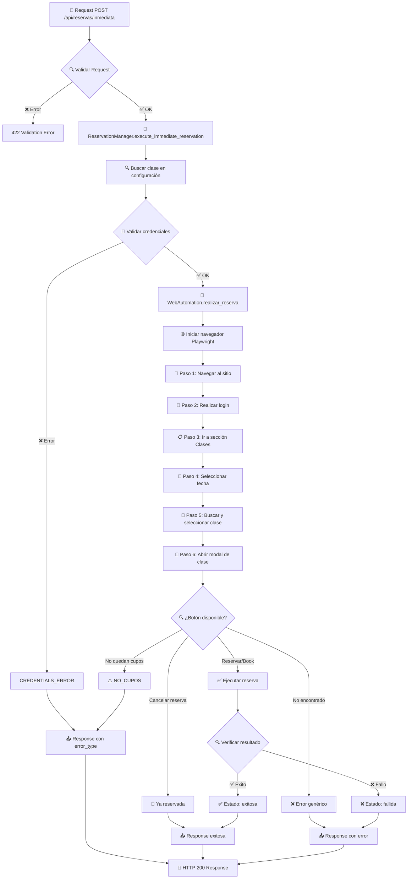
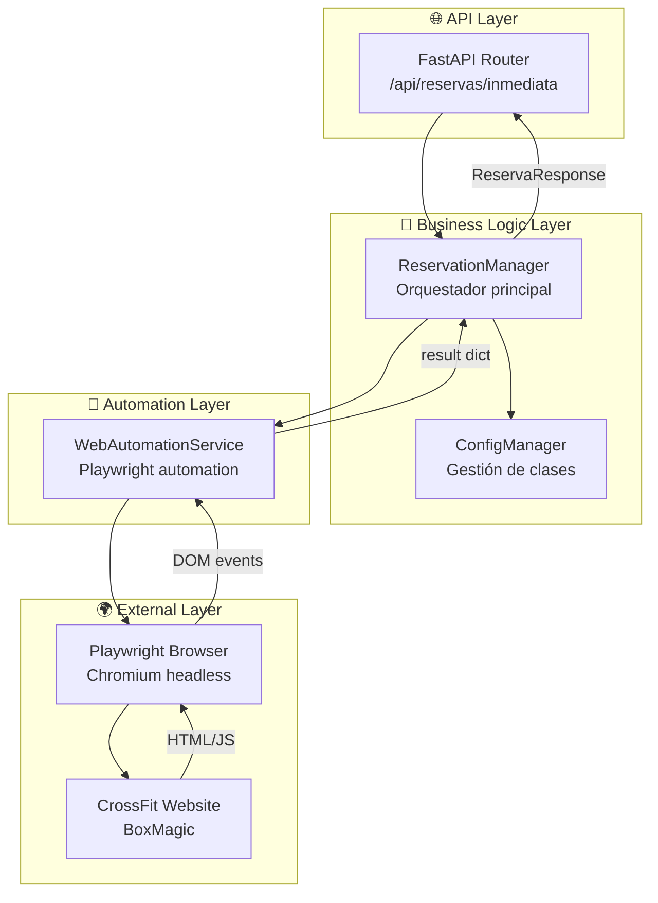
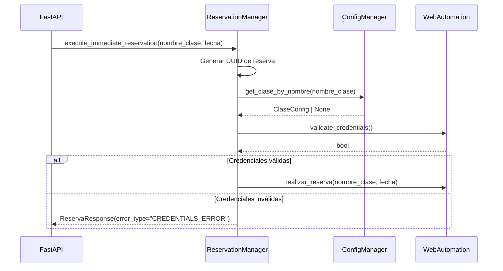
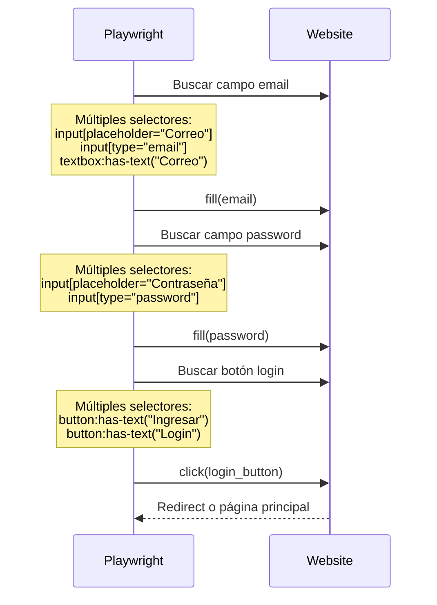

# 🔄 Flujo de Reserva - Documentación Técnica

## Resumen del Flujo

El proceso de reserva automática sigue un flujo de 6 pasos principales, desde la validación inicial hasta la confirmación de la reserva. Este documento detalla cada paso, los posibles errores y las validaciones implementadas.

## 📊 Diagrama de Flujo Principal



## 🏗️ Arquitectura de Componentes



## 📋 Flujo Detallado por Pasos

### 🎯 Paso 0: Inicialización (ReservationManager)



### 🌐 Paso 1: Navegación al Sitio

**Duración estimada:** 2-3 segundos

```python
# Configuración del navegador
browser_args = [
    '--disable-blink-features=AutomationControlled',
    '--disable-dev-shm-usage', 
    '--disable-gpu',
    '--no-sandbox'
] if headless else []

# Navegación
await page.goto(crossfit_url, wait_until='networkidle')
```

**Posibles errores:**
- ❌ Timeout de red
- ❌ Sitio web no disponible  
- ❌ Error de DNS

### 🔐 Paso 2: Login

**Duración estimada:** 3-5 segundos



**Validaciones:**
- ✅ Campo email encontrado y llenado
- ✅ Campo password encontrado y llenado  
- ✅ Botón login encontrado y clickeado
- ✅ Redirección exitosa después del login

### 📋 Paso 3: Navegación a Clases

**Duración estimada:** 1-2 segundos

```python
# Selectores para encontrar enlace "Clases"
clases_selectors = [
    'text="Clases"',
    'div:has-text("Clases")', 
    'a[href*="clases"]',
    'a[href*="classes"]'
]
```

### 📅 Paso 4: Selección de Fecha

**Duración estimada:** 1-2 segundos

El sistema extrae el día de la semana y número del parámetro `fecha`:

```python
# Ejemplo: fecha = "VI 18"
partes_fecha = fecha.split()  # ["VI", "18"]
dia_semana = partes_fecha[0]  # "VI"
numero_dia = partes_fecha[1]  # "18"

# Estrategia optimizada: usar solo el número
await page.click(f'text="{numero_dia}"', timeout=5000)
```

**Mapeo de días:**
- `LU` = Lunes
- `MA` = Martes  
- `MI` = Miércoles
- `JU` = Jueves
- `VI` = Viernes
- `SA` = Sábado
- `DO` = Domingo

### 🎯 Paso 5: Buscar y Seleccionar Clase

**Duración estimada:** 2-3 segundos

```python
# Buscar clase por nombre exacto
clase_selector = f'text="{clase_nombre}"'
await page.wait_for_selector(clase_selector, timeout=8000)
await page.click(clase_selector)
```

**Ejemplo de selectores de clase:**
- `text="17:00 CrossFit 17:00-18:00"`
- `text="Competitor 19:00-20:00"`
- `text="08:00 CrossFit 08:00-09:00"`

### 💫 Paso 6: Ejecución de Reserva

**Duración estimada:** 3-8 segundos

Este es el paso más crítico donde se determina el resultado final:

```mermaid
flowchart TD
    A[Modal de clase abierto] --> B{🔍 ¿Qué botón está visible?}
    
    B -->|Reservar/Book| C[✅ Botón de reserva disponible]
    B -->|No quedan cupos<br/>No places left| D[⚠️ Sin cupos]
    B -->|Cancelar reserva<br/>Cancel booking| E[📝 Ya reservada] 
    B -->|Ninguno| F[❌ Error desconocido]
    
    C --> G[🎯 Click en Reservar/Book]
    G --> H[⏳ Esperar 2 segundos]
    H --> I{🔍 Verificar resultado}
    
    I -->|Botón "Cancelar reserva"| J[✅ Reserva exitosa]
    I -->|Botón "Cancel booking"| J
    I -->|Text "Reservada"| J
    I -->|Modal cerrado| K[✅ Probable éxito]
    I -->|Botones desaparecieron| K
    I -->|Timeout/Error| L[❌ Fallo]
    
    D --> M[📤 error_type: NO_CUPOS]
    E --> N[📤 Éxito: ya reservada] 
    F --> O[📤 Error genérico]
    J --> P[📤 Éxito: reserva confirmada]
    K --> Q[📤 Éxito: probable]
    L --> R[📤 Fallo: timeout]
```

## 🎛️ Estrategias de Detección

### Detección de Idioma

El sistema soporta español e inglés automáticamente:

| Elemento | Español | Inglés |
|----------|---------|---------|
| Botón reserva | `"Reservar"` | `"Book"` |
| Sin cupos | `"No quedan cupos"` | `"No places left"` |
| Cancelar | `"Cancelar reserva"` | `"Cancel booking"` |
| Estado | `"Reservada"` | `"Booked"` |

### Optimización por Modo

**Modo Headless (producción):**
- Prioriza selectores en inglés (`"Book"` antes que `"Reservar"`)
- Timeouts más cortos
- Menos verificaciones visuales

**Modo Visual (desarrollo):**
- Prioriza selectores en español  
- Timeouts más largos
- Más logging detallado

## ⚡ Optimizaciones de Performance

### Timeouts Optimizados

| Acción | Timeout Original | Timeout Optimizado | Razón |
|--------|------------------|-------------------|--------|
| Modal detection | 10s | 6s | Modal aparece rápidamente |
| Class search | 10s | 8s | Clases cargan en 3-5s |
| Button search | 5s | 3s | Botones aparecen inmediatamente |
| Verification | 8s | 5s | Respuesta rápida del servidor |

### Reducción de Esperas

```python
# Antes
await page.wait_for_timeout(3000)  # 3 segundos fijos

# Después  
await page.wait_for_timeout(800)   # 0.8 segundos optimizado
```

## 📊 Métricas de Performance

### Tiempos Promedio por Paso

```mermaid
gantt
    title Timeline de Reserva Completa
    dateFormat X
    axisFormat %s
    
    section Navegación
    Ir al sitio          :0, 3
    Login               :3, 8
    Ir a Clases         :8, 10
    
    section Reserva
    Seleccionar fecha   :10, 12
    Buscar clase        :12, 15  
    Ejecutar reserva    :15, 23
    
    section Verificación
    Confirmar resultado :23, 28
```



**Tiempo total promedio:** 25-30 segundos
**Tiempo crítico (Paso 6):** 8-10 segundos

## 🚨 Manejo de Errores

### Jerarquía de Errores

1. **🔍 Validación previa** → `CREDENTIALS_ERROR`
2. **⚠️ Sin cupos** → `NO_CUPOS` 
3. **📝 Ya reservada** → Éxito (sin error)
4. **❌ Técnicos** → `UNEXPECTED_ERROR`

### Estrategia de Reintentos

```python
# No reintentable
if error_type in ["NO_CUPOS", "CREDENTIALS_ERROR"]:
    return immediately
    
# Reintentable 
if error_type == "UNEXPECTED_ERROR":
    retry_with_backoff()
```

## 🔄 Estados Finales

| Estado | Descripción | HTTP | Error Type |
|--------|-------------|------|------------|
| `exitosa` | Reserva confirmada | 200 | `null` |
| `exitosa` | Ya estaba reservada | 200 | `null` |
| `fallida` | Sin cupos | 200 | `NO_CUPOS` |
| `fallida` | Error credenciales | 200 | `CREDENTIALS_ERROR` |
| `fallida` | Error técnico | 200 | `UNEXPECTED_ERROR` |

## 🎯 Próximas Optimizaciones

- [ ] **Paralelización** de validaciones
- [ ] **Cache** de elementos DOM frecuentes  
- [ ] **Predicción** de timing óptimo
- [ ] **Retries inteligentes** con backoff exponencial
- [ ] **Métricas** de éxito por horario/día
