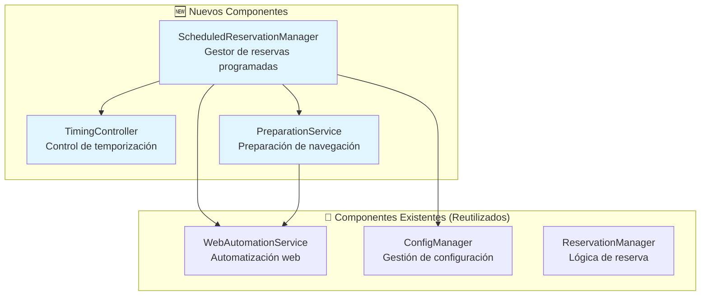
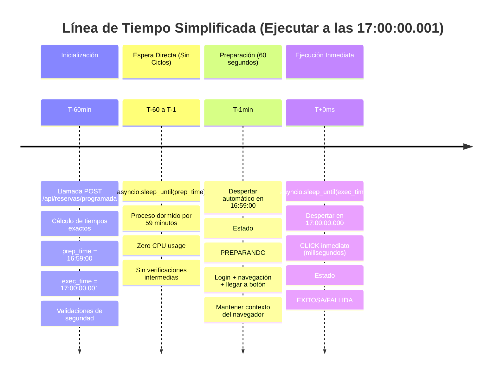
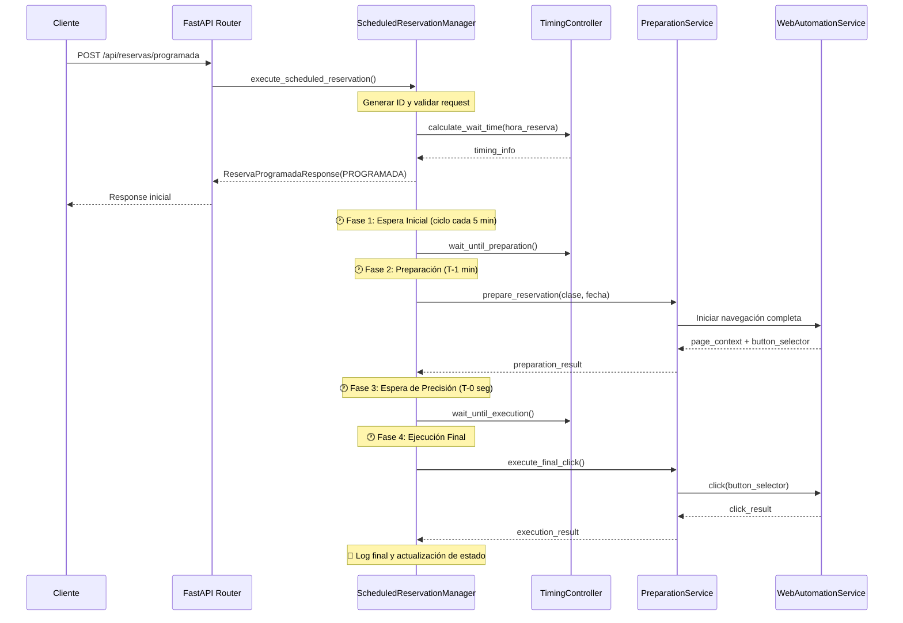

# 🕐 Especificación Técnica: Servicio de Reserva Programada

## 📋 Resumen Ejecutivo

Este documento define la implementación de un nuevo endpoint `/api/reservas/programada` que permite realizar reservas automáticas en un momento exacto predefinido. A diferencia del endpoint existente `/api/reservas/inmediata` que ejecuta la reserva de forma inmediata, este nuevo servicio incorpora un sistema de temporización inteligente para ejecutar la reserva exactamente 25 horas antes del inicio de la clase.

## 🎯 Objetivo Principal

Crear un servicio que permita reservar clases automáticamente en el **segundo exacto** en que se habilitan (25 horas antes del inicio), maximizando las posibilidades de éxito debido a la alta demanda y agotamiento rápido de cupos.

## 📊 Análisis del Problema

### Situación Actual
- **Endpoint existente**: `/api/reservas/inmediata` - Ejecuta reserva al momento de la llamada
- **Limitación**: No hay control temporal para reservas futuras
- **Problema crítico**: Los cupos se agotan en segundos cuando se habilitan las reservas

### Requerimiento de Negocio
- Las reservas se habilitan exactamente **25 horas antes** del inicio de la clase
- Los cupos son limitados y se agotan muy rápidamente
- Es crítico ejecutar la reserva en el **segundo exacto** de habilitación

### Ejemplo de Caso de Uso
```
📅 Clase: "18:00 CrossFit 18:00-19:00"
🕐 Inicio de clase: Lunes 18:00
⏰ Habilitación de reserva: Domingo 17:00:00
🎯 Momento de ejecución: Domingo 17:00:00 (exacto)
```

## 🏗️ Arquitectura de la Solución

### Componentes Nuevos



## 📋 Especificación Técnica Detallada

### 1. Nuevo Modelo de Datos

```python
class ReservaProgramadaRequest(BaseModel):
    nombre_clase: str                    # "18:00 CrossFit 18:00-19:00"
    fecha: str                          # "LU 21" 
    hora_reserva: str                   # "17:00:00" (formato HH:MM:SS)
    timezone: str = "America/Santiago"   # Zona horaria
    
class ReservaProgramadaResponse(BaseModel):
    id: str
    clase_nombre: str
    fecha: str
    hora_reserva: str
    estado: EstadoReservaProgramada
    fecha_creacion: datetime
    fecha_ejecucion_programada: datetime
    fecha_ejecucion_real: Optional[datetime]
    mensaje: str
    tiempo_espera_segundos: int
    error_type: Optional[str] = None

class EstadoReservaProgramada(str, Enum):
    PROGRAMADA = "programada"           # Esperando momento de ejecución
    PREPARANDO = "preparando"           # Iniciando navegación (T-1 min)
    EJECUTANDO = "ejecutando"           # Monitoreo de precisión hasta hora exacta
    EXITOSA = "exitosa"                 # Reserva completada exitosamente
    FALLIDA = "fallida"                 # Error en cualquier fase
```

### **🎯 Decisiones de Diseño Confirmadas**

- ✅ **Precisión**: Ejecución 1-2 segundos DESPUÉS de hora objetivo (no antes)
- ✅ **Preparación**: 60 segundos son suficientes para navegación completa
- ✅ **Scope**: Una reserva por llamada (sin múltiples simultáneas)
- ✅ **Persistencia**: Sin base de datos (proceso en memoria)
- ✅ **Cancelación**: No necesaria (usar app móvil)
- ✅ **Notificaciones**: No necesarias por ahora
- ✅ **Dashboard**: No necesario por ahora

### 2. Nuevo Endpoint

```python
@router.post("/reservas/programada", response_model=ReservaProgramadaResponse)
async def reserva_programada(request: ReservaProgramadaRequest):
    """
    Programa una reserva para ejecutarse en un momento exacto.
    
    Parámetros:
    - nombre_clase: Nombre exacto de la clase
    - fecha: Fecha en formato "XX ##" 
    - hora_reserva: Hora exacta de ejecución en formato "HH:MM:SS"
    
    Ejemplo de uso:
    {
        "nombre_clase": "18:00 CrossFit 18:00-19:00",
        "fecha": "LU 21",
        "hora_reserva": "17:00:00"
    }
    """
```

### 3. Flujo Simplificado **CÁLCULO DIRECTO - SIN CICLOS**



## 🔧 **Ventajas del Cálculo Directo**

### ✅ **Eliminamos Complejidad**
- ❌ Sin ciclos de 5 minutos
- ❌ Sin ciclos de 30 segundos  
- ❌ Sin verificaciones constantes
- ❌ Sin fases múltiples complicadas

### ✅ **Máxima Precisión**
- 🎯 Ejecución en **milisegundos exactos**
- 🎯 Sin deriva acumulativa por ciclos
- 🎯 Timing controlado por el sistema operativo

### ✅ **Eficiencia de Recursos**
- 💻 Casi zero CPU durante la espera
- 💻 Sin verificaciones innecesarias
- 💻 Memoria mínima utilizada

## 📚 **Ejemplos Actualizados - Cálculo Directo**

### **Ejemplo 1: Clase de Lunes**

```json
// Request desde Postman a las 16:00 del Domingo
POST /api/reservas/programada
{
    "nombre_clase": "18:00 CrossFit 18:00-19:00",
    "fecha": "LU 21", 
    "hora_reserva": "17:00:00"
}

// Flujo simplificado:
// 16:00:00 - Llamada recibida, cálculo directo
// 16:00:00 - asyncio.sleep(3540) // 59 minutos exactos
// 16:59:00 - Despertar automático, iniciar navegación
// 17:00:00 - asyncio.sleep(0.001) // 1 milisegundo  
// 17:00:00.001 - CLICK inmediato
```

### **Ejemplo 2: Llamada Muy Cercana (2 minutos antes)**

```json
// Request desde Postman a las 16:58 del Domingo
POST /api/reservas/programada
{
    "nombre_clase": "18:00 CrossFit 18:00-19:00",
    "fecha": "DO 20",
    "hora_reserva": "17:00:00"
}

// Flujo simplificado:
// 16:58:00 - Llamada recibida, cálculo directo
// 16:58:00 - asyncio.sleep(60) // 1 minuto exacto
// 16:59:00 - Despertar automático, iniciar navegación
// 17:00:00 - asyncio.sleep(0.001) // 1 milisegundo
// 17:00:00.001 - CLICK inmediato
```

### **Ejemplo 3: Error - Llamada Tardía**

```json
// Request desde Postman a las 17:01 (ya pasó la hora)
POST /api/reservas/programada
{
    "nombre_clase": "18:00 CrossFit 18:00-19:00",
    "fecha": "DO 20", 
    "hora_reserva": "17:00:00"
}

// Response inmediata (sin esperas):
{
    "estado": "fallida",
    "error_type": "TOO_LATE",
    "mensaje": "La hora de reserva ya pasó. Objetivo: 17:00:00, Actual: 17:01:05"
}
```

### 4. Nuevo Algoritmo Simplificado **SIN CICLOS**

```python
import asyncio
from datetime import datetime, timedelta
import pytz

class DirectTimingController:
    """
    Control de tiempo SIMPLIFICADO - Sin ciclos, solo cálculo directo
    """
    
    def __init__(self):
        self.timezone = pytz.timezone("America/Santiago")
    
    def calculate_execution_times(self, target_time_str: str) -> dict:
        """
        Calcula los dos momentos críticos de ejecución
        
        Args:
            target_time_str: "17:00:00" (hora objetivo)
            
        Returns:
        {
            "preparation_datetime": datetime,    # 16:59:00 (T-1min)
            "execution_datetime": datetime,      # 17:00:00.001 (T+1ms)
            "wait_until_prep_seconds": float,    # Segundos hasta preparación
            "wait_until_exec_seconds": float,    # Segundos hasta ejecución
            "is_valid": bool                     # Si es ejecutable
        }
        """
        now = datetime.now(self.timezone)
        today = now.date()
        
        # Crear datetime objetivo para hoy
        target_datetime = datetime.combine(
            today, 
            datetime.strptime(target_time_str, "%H:%M:%S").time()
        ).replace(tzinfo=self.timezone)
        
        # Si ya pasó, intentar mañana
        if target_datetime <= now:
            target_datetime += timedelta(days=1)
        
        # Momentos críticos
        prep_datetime = target_datetime - timedelta(minutes=1)
        exec_datetime = target_datetime + timedelta(milliseconds=1)
        
        return {
            "preparation_datetime": prep_datetime,
            "execution_datetime": exec_datetime,
            "wait_until_prep_seconds": (prep_datetime - now).total_seconds(),
            "wait_until_exec_seconds": (exec_datetime - now).total_seconds(),
            "is_valid": (prep_datetime - now).total_seconds() > 0
        }
    
    async def sleep_until(self, target_datetime: datetime):
        """
        Duerme hasta un momento exacto usando asyncio
        MÁXIMA PRECISIÓN - Sin ciclos ni verificaciones
        """
        now = datetime.now(self.timezone)
        sleep_seconds = (target_datetime - now).total_seconds()
        
        if sleep_seconds > 0:
            await asyncio.sleep(sleep_seconds)
```

## 🚀 **Orquestador Principal SIMPLIFICADO**

```python
class ScheduledReservationManager:
    """
    ORQUESTADOR PRINCIPAL - Flujo lineal sin ciclos
    """
    
    def __init__(self):
        self.timing_controller = DirectTimingController()
        self.web_automation = WebAutomationService()
    
    async def execute_scheduled_reservation(self, request: ReservaProgramadaRequest):
        """
        FLUJO PRINCIPAL - Máxima simplicidad
        """
        reservation_id = str(uuid.uuid4())
        logger.info(f"🎯 Iniciando reserva programada: {reservation_id}")
        
        try:
            # 1. CALCULAR tiempos exactos (sin ciclos)
            timing = self.timing_controller.calculate_execution_times(request.hora_reserva)
            
            if not timing["is_valid"]:
                return self._create_error_response("TOO_LATE", "La hora ya pasó")
            
            # 2. RESPUESTA INMEDIATA al usuario
            response = ReservaProgramadaResponse(
                id=reservation_id,
                estado=EstadoReservaProgramada.PROGRAMADA,
                tiempo_espera_segundos=int(timing["wait_until_exec_seconds"]),
                # ... otros campos
            )
            
            # 3. ESPERA DIRECTA hasta momento de preparación
            logger.info(f"⏳ Durmiendo hasta preparación: {timing['preparation_datetime']}")
            await self.timing_controller.sleep_until(timing["preparation_datetime"])
            
            # 4. PREPARACIÓN (60 segundos exactos)
            logger.info("🔧 Iniciando preparación web...")
            page_context = await self._prepare_web_navigation(request)
            
            if not page_context["success"]:
                return self._create_error_response("PREPARATION_FAILED", page_context["message"])
            
            # 5. ESPERA DIRECTA hasta momento exacto
            logger.info(f"⏰ Durmiendo hasta ejecución: {timing['execution_datetime']}")
            await self.timing_controller.sleep_until(timing["execution_datetime"])
            
            # 6. EJECUCIÓN INMEDIATA (milisegundos)
            logger.info("⚡ EJECUTANDO CLICK...")
            result = await self._execute_immediate_click(page_context)
            
            return self._create_success_response(reservation_id, result)
            
        except Exception as e:
            logger.error(f"💥 Error en reserva programada: {str(e)}")
            return self._create_error_response("UNEXPECTED_ERROR", str(e))
    
    async def _prepare_web_navigation(self, request):
        """
        Preparación completa de navegación web en 60 segundos
        """
        # Reutilizar WebAutomationService existente hasta llegar al botón
        # ... implementación
    
    async def _execute_immediate_click(self, page_context):
        """
        Click inmediato en el botón de reserva
        """
        # Click inmediato con máxima precisión
        # ... implementación
```

### 5. Servicio de Preparación

```python
class PreparationService:
    """
    Maneja la preparación de la navegación web antes de la ejecución
    """
    
    def __init__(self):
        self.web_automation = WebAutomationService()
    
    async def prepare_reservation(self, nombre_clase: str, fecha: str) -> dict:
        """
        Ejecuta toda la navegación web hasta llegar al botón de reserva
        
        Pasos:
        1. Iniciar navegador
        2. Login
        3. Navegar a clases
        4. Seleccionar fecha
        5. Buscar clase
        6. Abrir modal
        7. Validar que existe botón "Reservar"
        8. Mantener sesión activa
        
        Returns:
        {
            "success": bool,
            "page_context": PlaywrightPage,  # Contexto del navegador
            "ready_for_click": bool,         # Listo para hacer click
            "button_selector": str,          # Selector del botón encontrado
            "message": str
        }
        """
    
    async def execute_final_click(self, page_context, button_selector: str) -> dict:
        """
        Ejecuta el click final en el botón de reserva
        """
```

## 🔄 Flujo Completo del Nuevo Servicio



## ⚙️ Configuración y Parámetros

### Variables de Configuración

```python
# config/scheduled_reservations.py
TIMING_CONFIG = {
    "preparation_offset_seconds": 60,      # Comenzar preparación 1 min antes
    "execution_delay_seconds": 1,          # Ejecutar 1 segundo DESPUÉS de hora objetivo
    "initial_wait_cycle_seconds": 300,     # Ciclo inicial: 5 minutos
    "active_wait_cycle_seconds": 30,       # Ciclo activo: 30 segundos  
    "precision_wait_cycle_seconds": 1,     # Ciclo de precisión: 1 segundo
    "precision_threshold_seconds": 10,     # Activar precisión en últimos 10 seg
    "max_preparation_time_seconds": 90,    # Máximo tiempo de preparación
}

SAFETY_CONFIG = {
    "max_wait_time_hours": 24,             # Máximo tiempo de espera: 24h
    "timezone": "America/Santiago",        # Zona horaria por defecto
    "execution_window_seconds": 3,         # Ventana de ejecución válida: ±3 seg
}
```

## 🚨 Manejo de Errores y Edge Cases

### Tipos de Error Específicos
```python
class ScheduledReservationErrors:
    INVALID_TIMING = "INVALID_TIMING"           # Hora de reserva inválida
    TOO_LATE = "TOO_LATE"                       # Ya pasó la hora de reserva
    PREPARATION_FAILED = "PREPARATION_FAILED"   # Fallo en preparación
    TIMING_DRIFT = "TIMING_DRIFT"               # Deriva temporal detectada
    SESSION_EXPIRED = "SESSION_EXPIRED"         # Sesión web expiró
    NETWORK_INTERRUPTED = "NETWORK_INTERRUPTED" # Conectividad perdida
    EXECUTION_MISSED = "EXECUTION_MISSED"       # No se pudo ejecutar a tiempo
```

### Validaciones de Seguridad
1. **Validación temporal**: No permitir reservas para momentos pasados
2. **Límite de espera**: Máximo 48 horas de espera
3. **Validación de ventana**: Solo ejecutar dentro de ventana de ±5 segundos
4. **Monitoreo de deriva**: Detectar y corregir deriva de tiempo del sistema
5. **Recuperación de sesión**: Manejar expiración de sesión durante la espera

## 📈 Monitoreo y Logging

### Métricas Clave
- Tiempo de espera total
- Precisión de ejecución (diferencia con hora objetivo)
- Tasa de éxito en preparación
- Tasa de éxito en ejecución final
- Tiempo de navegación web

### Eventos de Log
```python
# Ejemplos de logs estructurados
logger.info("🕐 Reserva programada creada", extra={
    "reservation_id": uuid,
    "target_time": "17:00:00",
    "wait_seconds": 3600,
    "class_name": "18:00 CrossFit 18:00-19:00"
})

logger.info("🏁 Preparación iniciada", extra={
    "reservation_id": uuid,
    "preparation_start": datetime.now(),
    "target_execution": execution_time
})

logger.info("⚡ Ejecución realizada", extra={
    "reservation_id": uuid,
    "execution_time": datetime.now(),
    "target_time": target_time,
    "precision_ms": precision_milliseconds,
    "result": "success/failed"
})
```

## 🔄 Integración con Sistema Existente

### Reutilización de Componentes
- ✅ `WebAutomationService`: Reutilización completa para navegación
- ✅ `ConfigManager`: Para configuración de clases
- ✅ `ReservaResponse`: Extender para casos programados
- ✅ Validaciones existentes: Login, credenciales, etc.

### Nuevos Archivos a Crear
```
app/
├── services/
│   ├── scheduled_reservation_manager.py    # 🆕 Gestor principal
│   ├── timing_controller.py                # 🆕 Control de tiempo
│   └── preparation_service.py              # 🆕 Preparación web
├── models/
│   └── reserva.py                          # ➕ Extender modelos existentes
└── api/
    └── reservas.py                         # ➕ Agregar nuevo endpoint
```

## 🧪 Plan de Pruebas

### Casos de Prueba Críticos
1. **Prueba de precisión temporal**: Verificar ejecución en segundo exacto
2. **Prueba de preparación**: Validar navegación completa en <60 segundos
3. **Prueba de resistencia**: Esperas largas (varias horas)
4. **Prueba de recuperación**: Fallo de red durante espera
5. **Prueba de sincronización**: Múltiples reservas simultáneas

### Métricas de Éxito
- ✅ Precisión temporal: ±2 segundos del objetivo
- ✅ Tasa de éxito en preparación: >95%
- ✅ Tasa de éxito en ejecución: >90%
- ✅ Tiempo de preparación: <60 segundos
- ✅ Estabilidad de sesión: >99% durante espera

## 🚀 Roadmap de Implementación

### Fase 1: Componentes Base (Sprint 1)
- [ ] Crear modelos de datos extendidos
- [ ] Implementar `TimingController`
- [ ] Implementar algoritmo de espera inteligente
- [ ] Tests unitarios de temporización

### Fase 2: Preparación Web (Sprint 2) 
- [ ] Implementar `PreparationService`
- [ ] Integrar con `WebAutomationService` existente
- [ ] Manejo de sesión persistente
- [ ] Tests de preparación

### Fase 3: Orquestación (Sprint 3)
- [ ] Implementar `ScheduledReservationManager`
- [ ] Crear endpoint `/api/reservas/programada`
- [ ] Integración completa del flujo
- [ ] Tests de integración

### Fase 4: Productivización (Sprint 4)
- [ ] Monitoreo y logging avanzado
- [ ] Manejo robusto de errores
- [ ] Documentación de usuario
- [ ] Tests de carga y resistencia

## ❓ **RESUMEN DE CAMBIOS - DISEÑO FINAL**

### ✅ **Nuevas Decisiones Confirmadas**

1. **⚡ Precisión Temporal**: Ejecución en **milisegundos exactos** (17:00:00.001)
2. **🔧 Algoritmo Simplificado**: **Cálculo directo** sin ciclos ni fases complejas  
3. **💻 Eficiencia**: **asyncio.sleep()** directo hasta momentos críticos
4. **🎯 Dos Momentos Críticos**:
   - **Preparación**: T-1 minuto (16:59:00)
   - **Ejecución**: T+1 milisegundo (17:00:00.001)

### ✅ **Ventajas del Nuevo Diseño**

- ❌ **Eliminado**: Ciclos de 5 min, 30 seg, verificaciones constantes
- ✅ **Agregado**: Máxima precisión temporal con mínimo uso de recursos
- ✅ **Simplificado**: Flujo lineal fácil de entender y mantener
- ✅ **Optimizado**: Zero CPU durante esperas, despertar automático

### 🏗️ **Arquitectura Final**

```text
📱 Postman Request
     ↓
🧠 ScheduledReservationManager (orquestador simple)
     ↓
⏰ DirectTimingController (cálculo directo)
     ↓
🔧 Preparación Web (60 seg)
     ↓  
⚡ Ejecución Inmediata (milisegundos)
     ↓
📤 Response Final
```

## 🚀 **Estado: LISTO PARA IMPLEMENTAR**

La especificación está **completamente rediseñada** con:
- ✅ Algoritmo simplificado sin ciclos
- ✅ Máxima precisión temporal 
- ✅ Ejemplos actualizados
- ✅ Arquitectura optimizada

**¿Comenzamos con la implementación del primer componente (`DirectTimingController`)?**

---

**Documento finalizado**: 20 de julio de 2025  
**Versión**: 3.0 - CÁLCULO DIRECTO  
**Estado**: ✅ Diseño final aprobado
